## 一、集合

* 集合是一种容器，装数据，类似于数组，但是数组的长度是固定的，集合的长度是可变的。开发中集合更常用。
* 集合的体系结构：
  * Collection: 单列集合，每个元素（数据）只包含一个值
  * Map：双列集合，每个元素包含两个值（键值对）。

## 二、Collection集合

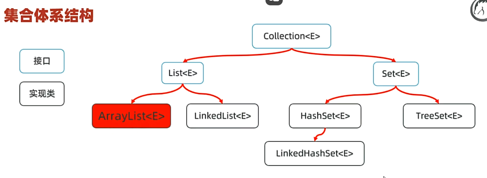

### 1.Collection集合特点

* List系列集合：添加的元素有序、可重复、有索引。
  * ArrayList/LinkedList：有序、可重复、有索引。
* Set系列集合：添加的元素无序、不可重复、无索引。
  * HashSet:  无序、不可重复、无索引。
  * LinkedHashSet：有序、不可重复、无索引。
  * TreeSet：排序、不可重复、无索引。
    举例：

```java
public static void main(String[] args) {
        //认识集合
        // 1.List家族集合：有序，可以重复，有索引
        List<String> list = new ArrayList<>();
        list.add("hello");
        list.add("world");
        list.add("java");
        System.out.println(list);//[hello, world, java]顺序与插入顺序一致
        System.out.println(list.get(0));

        //Set集合：无序，不可重复，没有索引；
        Set<String> set = new HashSet<>();
        set.add("hello");
        set.add("world");
        set.add("java");
        System.out.println(set);//[world, java, hello]无序，无重复
    }
```

### 2. Collection集合的功能：

**先学Collection的方法**

* Collection是单列集合的祖宗，它规定的方法（功能）是全部单列集合都会继承的。
  
* 常用方法：
  
  例子：

```java
  public static void main(String[] args) {
        //认识Collection的方法
        List<String> list = new ArrayList<String>();
        list.add("hello");
        list.add("world");
        list.add("java");
        list.add("python");
        list.add("c++");
        System.out.println(list);
        //获取集合的元素个数
        System.out.println(list.size());

        //删除元素
        list.remove(0);
        System.out.println(list);

        //判断集合是否为空
        System.out.println(list.isEmpty());

//        //清空集合
//        list.clear();
//        System.out.println(list);

        //集合转换成数组
        Object[] arr = list.toArray();
        System.out.println(Arrays.toString(arr));

        //集合转换成字符串数组
        String[] arr2 = list.toArray(new String[0]);
        System.out.println(Arrays.toString(arr2));

    }
```

### 3.Collection集合的遍历方式：

* 1.迭代器：迭代器是用来遍历集合的专用方式（数组没有迭代器），Java中，迭代器的代表是Iterator。
* Collection集合获取迭代器的方法：
  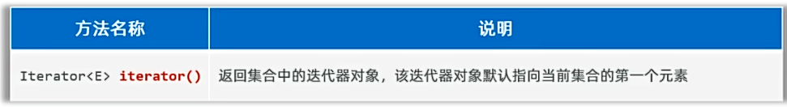
* Iterator迭代器的常用方法：
* 
  例子：

```java
 public static void main(String[] args) {
        //认识Collection迭代器遍历
        List<String> list = new ArrayList<String>();
        list.add("hello");
        list.add("world");
        list.add("java");
        list.add("python");
        list.add("c++");
        list.add("GO");
        System.out.println(list);

        //1.得到集合迭代器对象
        Iterator<String> it = list.iterator();
//        System.out.println(it.next());
//        System.out.println(it.next());
//        System.out.println(it.next());
//        System.out.println(it.next());
//        System.out.println(it.next());
//        System.out.println(it.next());
        //System.out.println(it.next());//报异常,NoSuchElementException
        //2.使用while循环遍历集合
        while(it.hasNext()){
            System.out.println(it.next());//若不定义变量直接输出it.next()，则只能写一次该方法，否则可能会报异常
        }
    }
```

### 4.增强for循环：


* 增强for可以遍历集合和数组。
* 增强for遍历集合，本质是迭代器遍历集合的简化写法。
  例子：

```java
  public static void main(String[] args) {
        //认识Collection迭代器遍历，for增强
        List<String> list = new ArrayList<String>();
        list.add("hello");
        list.add("world");
        list.add("java");
        list.add("python");
        list.add("c++");
        list.add("GO");
        System.out.println(list);

        for(String s : list){
            System.out.println(s);
        }

        //同时增强for可遍历数组
        int[] arr = {1,2,3,4,5,6,7,8,9,10};
        for(int i : arr){
            System.out.println(i);
        }
    }
```

### 5.Lambda表达式遍历：

* JDK8开始由于Lambda表达式，提供了一种更简单、更直接的方式遍历集合。
  
  例子：

```java
public class CollectionDemo5 {
    public static void main(String[] args) {
        //认识Collection迭代器遍历，for增强
        List<String> list = new ArrayList<String>();
        list.add("hello");
        list.add("world");
        list.add("java");
        list.add("python");
        list.add("c++");
        list.add("GO");
        System.out.println(list);

//        list.forEach(new Consumer<String>(){
//            @Override
//            public void accept(String s) {
//                System.out.println(s);
//            }
//        });
        //上述例子可简化为：
//        list.forEach( s  -> System.out.println(s));
        //使用方法引用接着简化：
        list.forEach(System.out::println);
    }
}
```

### 6.三种遍历方式的区别：

* 并发修改异常问题：
  * 遍历集合的同时又存在增删集合元素的行为时可能出现业务异常，被称之为并发修改异常问题。
    使用需求来说明并发修改异常问题：
    
    例子：

```java
public class CollectionDemo6 {
    public static void main(String[] args) {
        //认识并发修改异常问题
        ArrayList<String> list = new ArrayList<>();
        list.add("hello");
        list.add("world");
        list.add("java");
        list.add("python");
        list.add("C++");
        list.add("C");
        list.add("C#");
        list.add("GO");
        System.out.println(list);

        //删除带C的语言
//        for (int i = 0; i < list.size(); i++) {
//            String s = list.get(i);
//            if (s.contains("C")) {
//                list.remove(s);
//            }
//        }

//        [hello, world, java, python, C++, C, C#, GO]
//        [hello, world, java, python, C, GO]
        //此时，出现了并发修改异常，因为，在for循环中，我们删除了list中的元素，导致list.size()的值发生了变化
        //因为当i=4时，list删除了C++，导致C到了C++的位置，此时i+1=5，无法遍历到C，因此C并未被删除
        //解决方案一：若要用for循环解决上述问题，在末尾让i--，即可(前提要支持索引)
//        for (int i = 0; i < list.size(); i++) {
//            String s = list.get(i);
//            if (s.contains("C")) {
//                list.remove(s);
//                i--;
//            }
//        }
//        System.out.println(list);
        //解决方案二：倒过来遍历，即从后往前遍历，这样删除的索引不会发生变化（前提要支持索引）
//        for (int i = list.size() - 1; i >= 0; i--) {
//            String s = list.get(i);
//            if (s.contains("C")) {
//                list.remove(s);
//            }
//        }
//        System.out.println(list);
        //迭代器修改
        Iterator<String> it = list.iterator();
        while (it.hasNext()) {
            String s = it.next();
            if (s.contains("C")) {
//                list.remove(s);//会出现并发修改异常，需要使用迭代器自己的方法
                it.remove();
            }
        }
        System.out.println(list);
        //使用增强for和Lambda表达式都无法解决问题
        //由此可得出结论：增强for和Lambda表达式只适合用于遍历，不适合用于修改
    }
}
```

* **由上述例子最终可以得出并发修改异常的解决方案：**
  * 1.若集合支持索引，可使用for循环遍历，每删除数据后i--，或者从后往前倒着遍历。
  * 2.若集合不支持索引，使用迭代器遍历，使用迭代器的remove方法删除数据。
  * **3.增强for和Lambda表达式只适合用于遍历，不适合用于修改。无法解决并发修改异常**

## 三：List集合

* List集合继承Collection集合，Collection集合的功能它都有，另外它支持索引，因此也有很多索引相关的方法。
  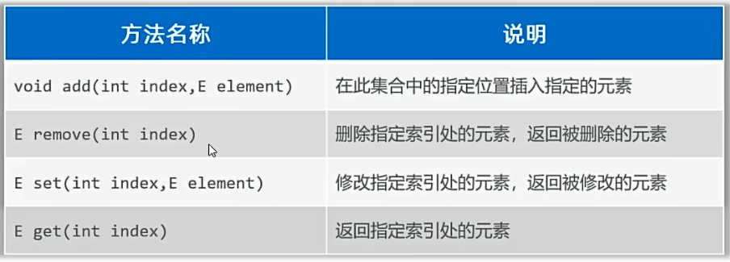
  例子见上述所示
* List集合支持的遍历：
  * for循环
  * 增强for
  * Lambda表达式
  * 迭代器
* ArrayList集合和LinkedList集合的区别：底层采用的数据结构不同，应用场景不同。
  * ArrayList集合：底层基于数组存储数据
    * 查询速度快（根据索引查询数据快）：查询通过地址值和索引定位，查询任意数据耗时相同。
      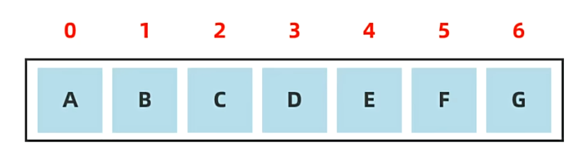
    * 增删数据效率低：可能需要把后面的数据全部进行前移。
  * LinkedList集合：底层基于双链表存储数据
    * 链表：链表中的数据是一个一个独立的结点组成，结点在内存中不连续每个结点包含数据值和下一个结点的地址。
    * 链表特点：查询慢，无论查询哪个数据都是从头开始找。
    * 链表特点：增删数据相对快
      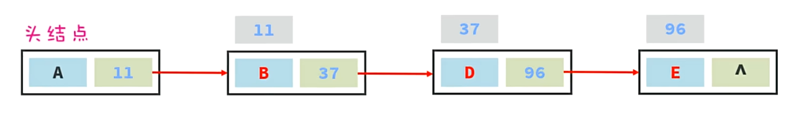
    * 双链表：
      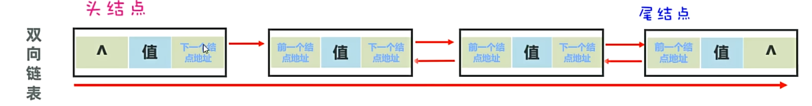
    * 特点：对首尾元素进行增删改查的速度非常快
      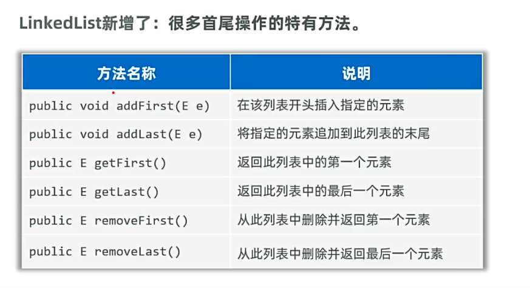
* LinkedList集合应用场景：
  * 1.设计队：先进先出，后进后出
  * 2.设计栈：先进后出，后进先出

## 四：Set集合

* **Set集合继承Collection集合，无序（添加数据顺序和获取数据的顺序不一致）；不重复；无索引。**
  * HashSet:  无序、不可重复、无索引。
  * LinkedHashSet：有序、不可重复、无索引。
  * TreeSet：排序、不可重复、无索引。
  * **注意：Set要用到的常用方法，就是由Collection集合继承过来的，它自身几乎没有额外功能。**
* **Set集合底层原理：**
  * 哈希值：一个int类型的随机值，Java中每个对象都有一个哈希值。
  * Java中的所有对象，都可以调用Object类的hashCode方法，返回当前对象的哈希值。
  * 基于哈希表存储
* **对象哈希值的特点：**
  * 同一个对象多次调用hashCode方法，返回的哈希值是相同的。
  * 不同的对象，哈希值大概率不相等，但也有可能相等（哈希碰撞）。
* **对于哈希表：**
  * JDK8以前，哈希表=数组+链表：
    * *1.* 添加数据时，创建一个默认长度为16的数组，默认加载因子为0.75，数组名为table。
       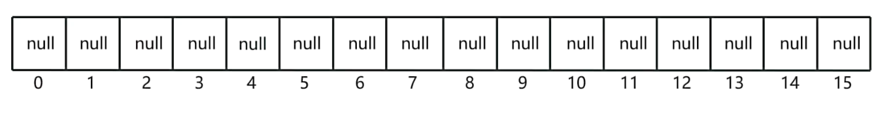
    * *2.* 使用元素的哈希值对数组的长度做运算计算应存入的位置（相当于求余运算，将哈希值除以数组长度取余，得到的余数即为该数据的存储位置）
    * *3.* 判断当前位置是否为null，是null，则直接存入。
    * *4.* 如果当前位置不为null，则调用equals方法判断当前位置的元素和要存入的元素是否相等，如果相等，则不存入。如果不相等：**在JDK8以前，新元素存入数组，占用老元素的位置，新元素作为链表的头结点，地址指向老元素的位置，即将老元素挂在新元素的下面;** **JDK8以后，新元素直接挂在老元素下面**
    * 扩容机制：当数组长度达到阈值（数组长度*加载因子）时，扩容到数组长度的2倍。
  * JDK8以后，哈希表=数组+链表+红黑树：
    * JDK8以后，当链表长度达到8，且数组长度大于等于64时，链表转换为红黑树，红黑树增删改查性能比链表高。
    * 关于二叉树：
  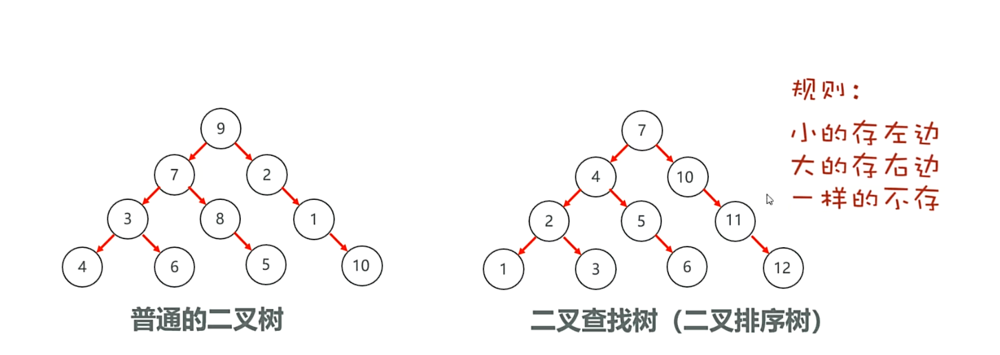
    * 二叉树的问题：若数据已经排好序，就会导致性能和单链表一样，查询速度变慢：
    * 平衡二叉树：在满足查找二叉树的规则下，让树尽可能矮小，提高查询速度
    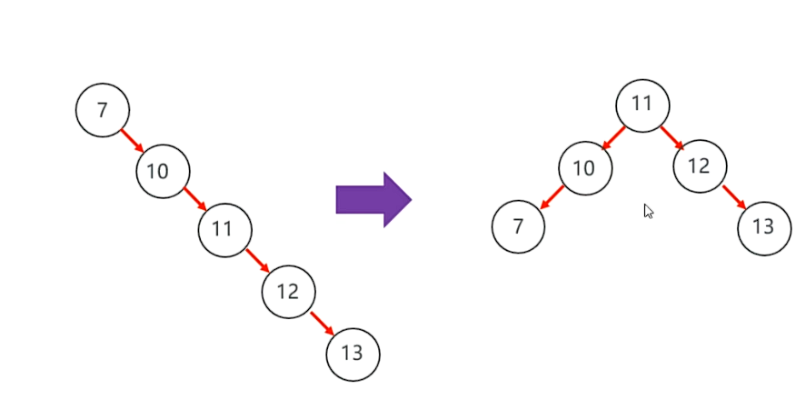
    * 红黑树：可以自平衡的二叉树。一种增删改查数据性能都相对好的结构。
   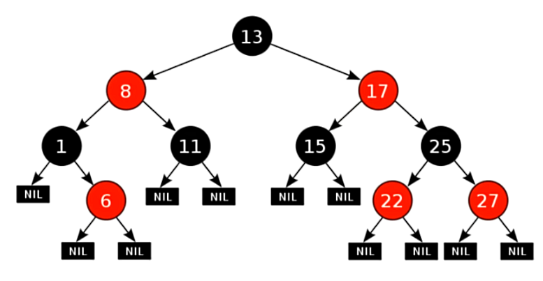
  * 哈希表是一种增删改查数据，性能都挺好的数据结构
## 五、HashSet集合元素去重

* HashSet集合元素去重：如果希望Set集合认为两个内容一样的对象是重复的, 需要重写对象的hashCode()和equals()方法
例子：
```java
//main方法
public static void main(String[] args) {
        //HashSet去重
        Student  s1 = new Student("张三", 18, "男");
        Student  s2 = new Student("李四", 19, "女");
        Student  s3 = new Student("王五", 20, "男");
        Student  s4 = new Student("张三", 18, "男");
        Set<Student> set = new HashSet<Student>();
        set.add(s1);
        set.add(s2);
        set.add(s3);
        set.add(s4);
        System.out.println(set);//没能去重，因为哈希值不一样
    }
```
```java
//Student.java
public class Student {
    private String name;
    private int age;
    private String sex;

    public Student() {
    }

    public Student(String name, int age, String sex) {
        this.name = name;
        this.age = age;
        this.sex = sex;
    }

    @Override
    public String toString() {
        return "Student{" +
                "name='" + name + '\'' +
                ", age=" + age +
                ", sex='" + sex + '\'' +
                '}' + "\n";
    }

    @Override
    public boolean equals(Object object) {
        if (this == object) return true;
        if (object == null || getClass() != object.getClass()) return false;
        Student student = (Student) object;
        return age == student.age && Objects.equals(name, student.name) && Objects.equals(sex, student.sex);
    }

    @Override
    public int hashCode() {
        return Objects.hash(name, age, sex);
    }

    public String getName() {
        return name;
    }

    public void setName(String name) {
        this.name = name;
    }

    public int getAge() {
        return age;
    }

    public void setAge(int age) {
        this.age = age;
    }

    public String getSex() {
        return sex;
    }

    public void setSex(String sex) {
        this.sex = sex;
    }
}
```
## 六、LinkedHashSet的底层原理：
* 依然是基于哈希表（数组、链表、红黑树）实现。**不过，它的每个元素都额外多了一个双链表的机制记录了它前后元素的位置。**
## 七、TreeSet集合：
* 不重复，无索引，可排序（默认升序排序，按元素大小，由小到大）
* 底层原理：基于红黑树实现
* 注意：
  * 对于数值类型：Integer、Double，默认按照数值本身大小升序排序。
  * 对于字符串类型：String，默认按照首字符的编号升序排序。 
  * **对于自定义的对象，如Student，TreeSet默认无法进行直接排序。**
  * TreeSet集合存储自定义类型的对象时，必须要指定排序规则，支持如下两种方式比较：
例子：
```java
//1.在Student实现Comparable接口，并重写compare方法，指定自定义排序规则
public class Student implements Comparable<Student> {
    private String name;
    private Integer age;
    private String sex;
    private Double score;

    //s2.compareTo(s1)
    //s2 == this 比较者
    //s1 == o 被比较者
    // s2>s1 返回正整数; s2<s1 返回负整数; s2==s1 返回0
    @Override
    public int compareTo(Student o) {
        if (this.getScore() > o.getScore()) return 1;
        if (this.getScore() <= o.getScore()) return -1;
        return 0;//升序
        //若要降序，更换返回值即可，可简化成
       // return Double.compare(this.getScore(), o.getScore());
    }

    public Student() {
    }

    public Student(String name, int age, String sex, Double score) {
        this.name = name;
        this.age = age;
        this.sex = sex;
        this.score = score;
    }

    @Override
    public String toString() {
        return "Student{" +
                "name='" + name + '\'' +
                ", age=" + age +
                ", sex='" + sex + '\'' +
                ", score=" + score +
                '}' + "\n";
    }


    @Override
    public boolean equals(Object object) {
        if (this == object) return true;
        if (object == null || getClass() != object.getClass()) return false;
        Student student = (Student) object;
        return Objects.equals(name, student.name) && Objects.equals(age, student.age) && Objects.equals(sex, student.sex) && Objects.equals(score, student.score);
    }

    @Override
    public int hashCode() {
        return Objects.hash(name, age, sex, score);
    }

    public String getName() {
        return name;
    }

    public void setName(String name) {
        this.name = name;
    }

    public int getAge() {
        return age;
    }

    public void setAge(int age) {
        this.age = age;
    }

    public String getSex() {
        return sex;
    }

    public void setSex(String sex) {
        this.sex = sex;
    }

    public Double getScore() {
        return score;
    }

    public void setScore(Double score) {
        this.score = score;
    }

}
```
```java
public class SetDemo3 {
    public static void main(String[] args) {
        //认识TreeSet自定义排列规则

//        Set<Student> students = new TreeSet<>(
//        //2.public TreeSet集合自带比较器Comparator对象，指定比较规则
//        new Comparator<Student>() {
//            @Override
//            public int compare(Student o1, Student o2) {
//
//                return Double.compare(o1.getScore() , o2.getScore());
//            }
//        });
        //上述代码可简化为：
        Set<Student> students = new TreeSet<>((o1, o2) -> Double.compare(o1.getScore(), o2.getScore()));
        students.add(new Student("张三", 20, "男", 99.0));
        students.add(new Student("李四", 19, "女", 80.0));
        students.add(new Student("王五", 18, "男", 100.0));
        students.add(new Student("赵六", 16, "男", 70.0));
        students.add(new Student("王二麻子", 18, "男", 60.0));

        //System.out.println(students);//ClassCastException, 因为TreeSet需要排序，但不能给自定义对象排序，而代码中又没给排序规则
        //两种方案解决问题：
        //1.在Student实现Comparable接口，并重写compare方法，指定自定义排序规则
        System.out.println(students);
        //2.public TreeSet集合自带比较器Comparator对象，指定比较规则
    }
}
```
