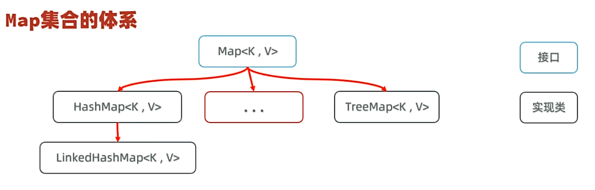
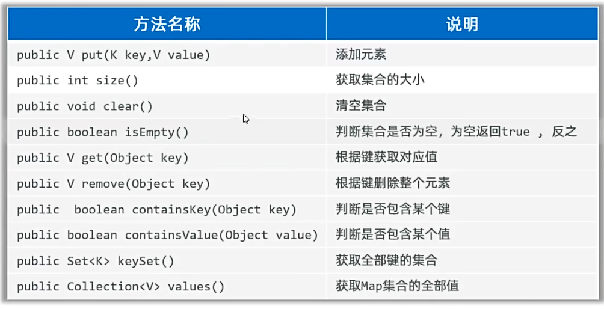
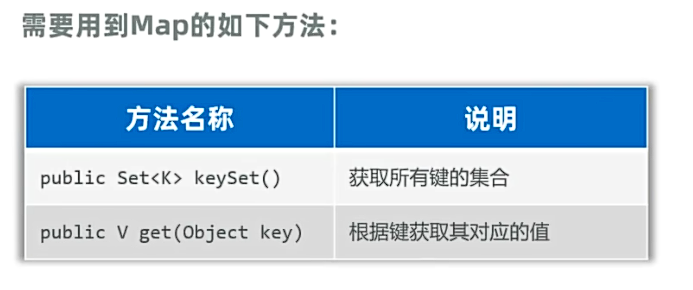
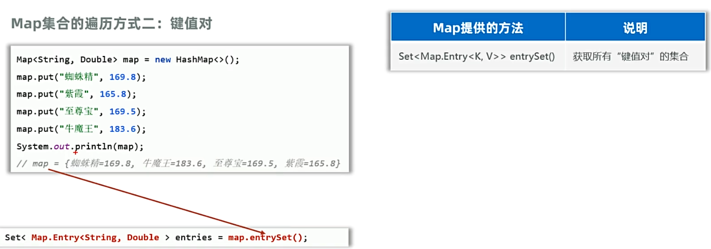
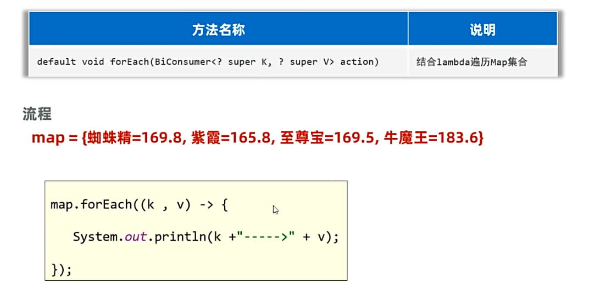
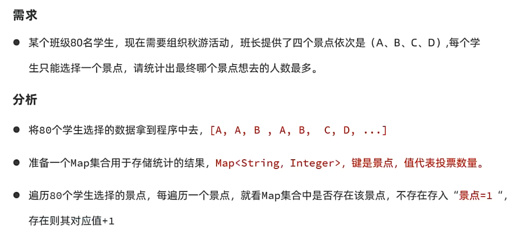

## 一、Map集合
* Map集合又叫“键值对集合”，格式：{key1=value1,key2=value2,key3=value3,...}
* Map集合的键是唯一的，值可以重复，值和键一一对应，每一个键只能找自己对应的值
* 使用场景：存一一对应的数据时，即可考虑使用Map集合
* Map集合的体系：
 
* Map集合的特点：
  * **Map集合的特点都是由键决定的，值是附属品，不做要求**
  * HashMap(由键决定特点)：无序、不重复、无索引；
  * LinkedHashMap(由键决定特点)：有序、不重复、无索引；
  * TreeMap(由键决定特点)：默认升序排序（只能对键排序）、不重复、无索引；
* Map集合的常用方法：
  * Map集合是双列集合的祖宗，它的功能是可以被其他Map集合所继承使用
  
## 二、Map集合的遍历：
### 1.键找值：
* 先获取Map集合所有的键，再通过遍历键获取对应的值
 
### 2.键值对：

### 3.Lambda表达式遍历：
* 使用如下方法：
 
* 三种遍历方式的例子：
```java
public class MapDemo1 {
    public static void main(String[] args) {
        //认识Map集合
        //1.创建Map集合
        //HashMap特点：无序，不能重复，无索引，键值对可以是null，值不要求（可重复）
        //TreeMap特点：按照键升序排序，不能重复，无索引，键值对可以是null，值不要求（可重复）
        //Map<String,Integer> map = new HashMap<>();
        //LinkedHashMap特点：有序，不能重复，无索引，键值对可以是null，值不要求（可重复）
        Map<String,Integer> map = new LinkedHashMap<>();
        map.put("张三",18);
        map.put("李四",19);
        map.put("王五",20);
        map.put("赵六",21);
        map.put("张三",22);//键重复，值覆盖
        map.put(null,null);
        System.out.println(map);

        //认识Map集合的遍历
        //1.通过键来找值
        //提取键值
        Set<String> keySet = map.keySet();
        //遍历键
        for (String key : keySet) {
            //通过键获取值
            Integer value = map.get(key);
            System.out.println(key + "=" + value);
        }
        System.out.println("=====================");
        //2.通过键值对来遍历
        //将Map集合转换成Set集合，Set集合中元素都是键值对类型（Map.Entry<String, Integer>）
        Set<Map.Entry<String, Integer>> entrySet = map.entrySet();
        //遍历转化出来的Set集合，获取每一个键值对
        for (Map.Entry<String, Integer> entry : entrySet) {
            //获取键
            String key = entry.getKey();
            //获取值
            Integer value = entry.getValue();
            System.out.println(key + "=" + value);
        }
        System.out.println("=====================");
        //3.Lambda表达式遍历
        //调用foreach方法，遍历Map集合
//        map.forEach(new BiConsumer<String, Integer>() {
//            @Override
//            public void accept(String s, Integer integer) {
//                System.out.println(s + "=" + integer);
//            }
//        });
        //简化：
//        map.forEach((String s, Integer integer) -> {System.out.println(s + "=" + integer);});
        //继续简化：
        map.forEach((String s, Integer integer) -> System.out.println(s + "=" + integer));
    }
}
```
## 三、经典案例：

```java
    // 利用Map完成投票统计案例：
    //80个学生，给A,B,C,D投票，统计每个字符出现的次数
    public static void vote(){
        // 1.存储80个学生选择的数据
        List<String> list = new ArrayList<>();
        // 2.模拟80个学生投票
        String[] arr = {"A","B","C","D"};
        //3.初始化一个随机数对象存储数据
        Random r = new Random();
        for (int i = 0; i <= 80; i++) {
            int index = r.nextInt(arr.length);
            list.add(arr[index]);
        }
        System.out.println(list);
        // 4.统计每个字符出现的次数
        //使用Map集合统计，键为ABCD，值为每个字符出现的次数
        Map<String,Integer> map = new HashMap<>();
        for (String s : list) {
            //判断map集合中是否有该字符
//            if(map.containsKey(s)){
//                //如果有，则将次数+1
//                map.put(s,map.get(s)+1);
//            }else{
//                //如果没有，则第一次出现，次数为1
//                map.put(s,1);
//            }
            //可简化为：
            map.put(s,map.containsKey(s) ? map.get(s) + 1 : 0);
        }
        //map的结果遍历出来
        map.forEach((s, integer) -> {
            System.out.println(s + "被选择了" + integer + "次");
        });
    }
```
## 四、Map的底层原理：
### 1.HashMap的底层原理：
* **之前的Set集合的底层就是基于Map实现的，只是Set集合中的元素只要键数据，不要值数据。
* HashMap和Set集合底层原理是一模一样的，都是基于数组+链表+红黑树实现的
### 2.LinkedHashMap的底层原理：
* **实际上，原来学习的LinkedHashSet的底层原理和LinkedHashMap一样。**
* 底层数据结构依然是基于哈希表实现，只是每个键值对元素额外多了一个双链表的机制记录元素顺序（保证有序）。
### 3.TreeMap的底层原理：
* TreeMap底层基于红黑树实现排序，TreeMap和TreeSet的底层原理一样。
* **TreeMap同样支持两种方式指定排序规则：**
  * 1.让类实现一个Comparable接口，并重写compareTo方法，按照升序排序
  * 2.TreeMap集合有一个参数比较器，支持创建Comparator比较器对象，用于指定比较规则。
  
