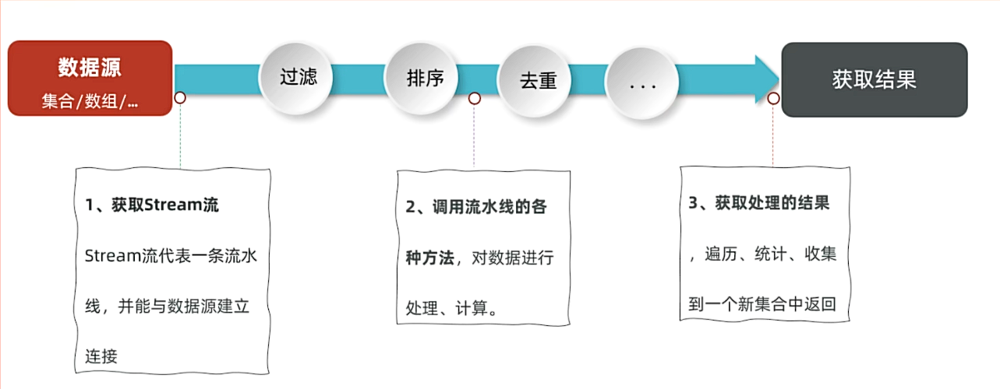
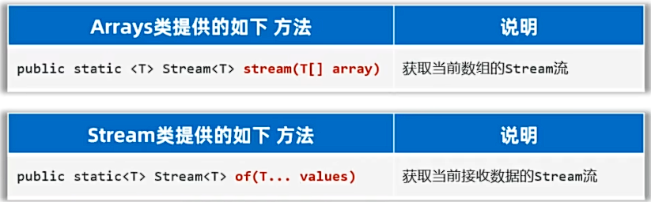
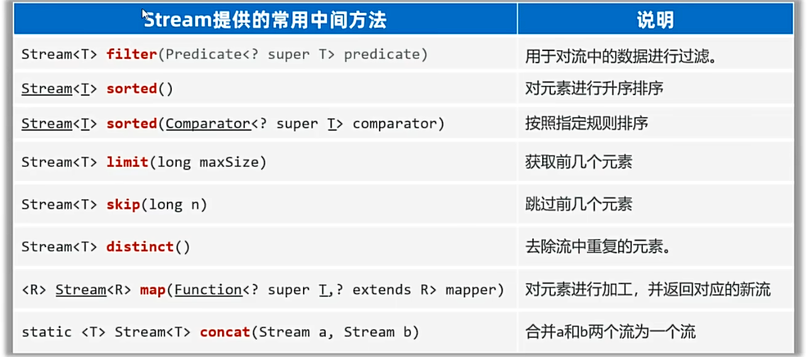
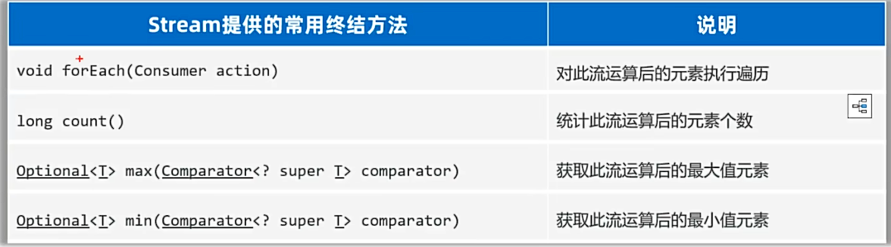
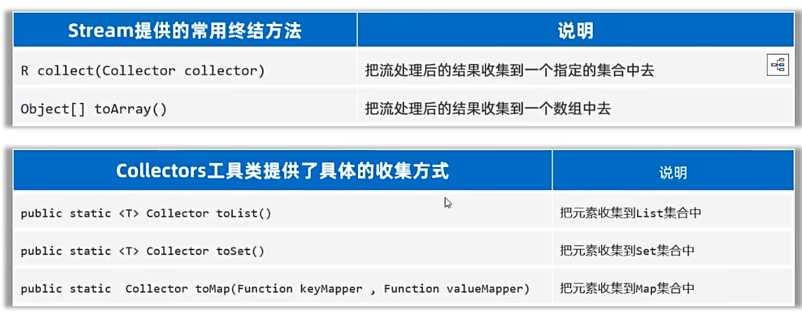
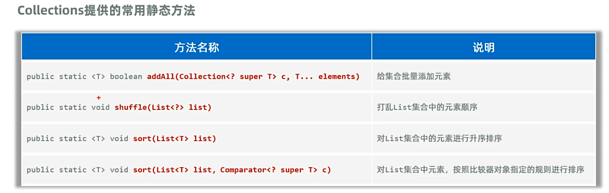

## 一、Stream流
* Stream流：是JDK8新增的一套API（java.util.stream.*）,用于操作集合或数组的数据。
* 优势：Stream流结合了Lambda表达式的风格编程，功能强大，性能高效，代码简洁，可读性好。
例子：
```java
public static void main(String[] args) {
        //学习Stream流的基本使用
        List<String> list = new ArrayList<>();
        list.add("hello");
        list.add("world");
        list.add("java");
        list.add("python");
        list.add("C++");
        list.add("GO");
        list.add("C");
        list.add("C#");
        list.add("JavaScript");
        //用传统方式找出名字中带C的编程语言存入新的集合
        List<String> list2 = new ArrayList<>();
        for (String s : list) {
            if (s.contains("C")) {
                list2.add(s);
            }
        }
        System.out.println(list2);

        System.out.println("---------------------------------");
        //改用stream流：
        List list3 = list.stream()
                .filter(s -> s.contains("C"))
                .toList();
        System.out.println(list3);
    }
```
* **Stream流操作步骤：**
  
* **1.获取Stream流：**
  * 获取集合的Stream流：
   
  * 获取数组的Stream流：
 
例子：
```java
public static void main(String[] args) {
        //学习Stream流获取方法
        //1.集合的stream()方法
        List<String> list = new ArrayList<>();
        Stream<String> stream = list.stream();

        //2.Map集合，获取Stream流:
        Map<String,String> map = new HashMap<>();
        //获取key的Stream流：
        Stream<String> stream1 = map.keySet().stream();
        //获取value的Stream流：
        Stream<String> stream2 = map.values().stream();
        //获取键值对的Stream流：
        Stream<Map.Entry<String, String>> stream3 = map.entrySet().stream();

        //3.数组，获取Stream流：
        String[] arr = {"a","b","c"};
        Stream<String> stream4 = Arrays.stream(arr);
        System.out.println(stream4.count());
        System.out.println("================================");
        Stream<String> stream5 = Stream.of(arr);
        System.out.println(stream5.count());
        System.out.println("================================");
        Stream<String> stream6 = Stream.of("a","b","c");
        System.out.println(stream6.count());
    }
```
* **2.Stream的中间方法：**
  
例子：
```java
public static void main(String[] args) {
        //Stream流的中间方法
        List<String> list = new ArrayList<>();
        list.add("java");
        list.add("python");
        list.add("C++");
        list.add("GO");
        list.add("C");
        list.add("C#");
        list.add("JavaScript");
        //过滤方法：过滤其中含有C的字符串
        list.stream().filter(s -> s.contains("C")).forEach(System.out::println);
        System.out.println("---------------------------------");
        //排序方法：
        List<Double> list2 = new ArrayList<>();
        list2.add(1.2);
        list2.add(7.8);
        list2.add(5.6);
        list2.add(3.4);
        list2.add(5.6);
        list2.add(7.8);
        list2.stream().sorted().forEach(System.out::println);//升序排序
        System.out.println("---------------------------------");
        list2.stream().sorted(((o1, o2) -> o2.compareTo(o1))).forEach(System.out::println);//降序排序
        System.out.println("---------------------------------");
        list2.stream().sorted(((o1, o2) -> o2.compareTo(o1))).limit(2).forEach(System.out::println);//降序排序,保留前两个
        System.out.println("---------------------------------");
        list2.stream().sorted(((o1, o2) -> o2.compareTo(o1))).skip(2).forEach(System.out::println);//降序排序,跳过前两个
        System.out.println("---------------------------------");
        //若希望对象可以去重，需要重写equals方法和hashCode方法
        list2.stream().sorted(((o1, o2) -> o2.compareTo(o1))).distinct().forEach(System.out::println);//降序，且去重
        System.out.println("---------------------------------");
        //加工方法：
        list2.stream().map(o -> "加十分后：" + (o + 10)).forEach(System.out::println);//每个数字加十
        System.out.println("---------------------------------");
        //合并流：
        Stream<String> stream = Stream.of("A", "B", "C","张三", "李四","王五");
        Stream<Integer> stream1 = Stream.of(1, 2, 3,4,5,6,7,8,9,10);
        Stream<Object> stream2 =Stream.concat(stream,stream1);
        stream2.forEach(System.out::println);
    }
```
* **3.Stream的终结方法：**
  * 终结方法是指调用完成后，就不会再返回新的Stream流，没法继续使用了。
   
* **4.收集Stream流**
  * 收集Stream流，将Stream流中的数据操作完成后的结果转回集合或数组中返回。 
  * Stream流：方便操作集合/数组的手段；集合/数组：才是开发的目的。
     
例子：
```java
public static void main(String[] args) {
        //Stream流的终结方法：
        List<Student> list = new ArrayList<>();
        list.add(new Student("小王", 18, "男", 100.0));
        list.add(new Student("张三", 20, "男", 70.0));
        list.add(new Student("李四", 19, "男", 80.0));
        list.add(new Student("王五", 18, "男", 90.0));
        list.stream().filter(s -> s.getAge() > 18).forEach( System.out::println );
        System.out.println("==============");
        Long count = list.stream().filter(s -> s.getScore() > 80).count();
        System.out.println(count);
        System.out.println("==============");
        Optional<Student> max = list.stream().max(Comparator.comparing(Student::getScore));
        System.out.println(max.get());
        System.out.println("==============");
        Optional<Student> min = list.stream().min(Comparator.comparing(Student::getScore));
        System.out.println(min.get());
        System.out.println("==============");
        //收集Stream流:收集到List集合中:
        //流只能收集一次，不能重复收集
        Stream<Student> s1 = list.stream().sorted(Comparator.comparing(Student::getScore));
        List<Student> list2 = s1.collect(Collectors.toList());
        System.out.println(list2);
        System.out.println("==============");
        //收集到Set集合中:
        Stream<Student> s2 = list.stream();
        Set<Student> set = s2.collect(Collectors.toSet());
        System.out.println(set);
        System.out.println("==============");
        //收集到数组中：
        Stream<Student> s3 = list.stream().sorted(Comparator.comparing(Student::getScore));//
        Object[] arr = s3.toArray();
        System.out.println(Arrays.toString(arr));
        System.out.println("==============");
        //收集到Map集合中：
        Map<String, Double> map = list.stream().collect(Collectors.toMap(Student::getName, Student::getScore));
        System.out.println(map);
    }
```
## 二、可变参数
* 就是一种特殊的形参，定义在方法、构造器的形参列表里，格式是：**数据类型... 参数名称**
* **可变参数的特点和好处：**
  * 特点：可以不传数据给它；可以传一个或同时传多个数据给它；也可以传一个数组给它；
  * 好处：常常用来灵活的接收数据。
* 可变参数注意事项：
  * 可变参数在方法内部就是一个数组。
  * 一个形参列表中的可变参数只能有一个。
  * 可变参数必须放在形参列表后面。
## 三、Collections集合工具类 
* **Collections集合工具类**：
  * 是一个用来操作集合的工具类。
 

