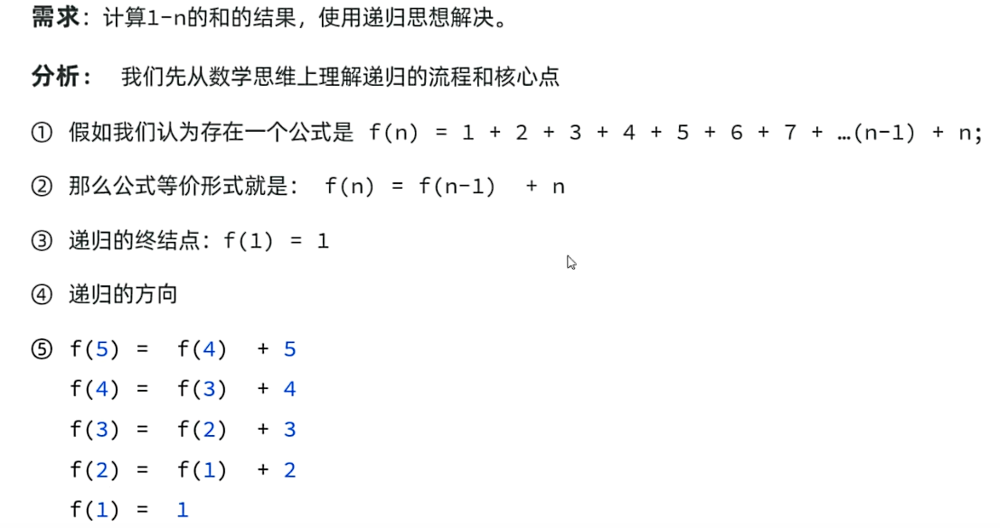

## 一、递归
* 递归：递归是一种算法，在程序设计语言中广泛应用。
* 从形式上说：方法调用自身的形式称之为方法递归（recursion）。
* 递归死循环：递归的次数没有限制，当递归次数过多时，可能会导致栈溢出。
例子：
```java
public class RecursionDemo1 {
    public static void main(String[] args) {
        //认识递归
        print1();
    }
    public static void print1(){
        System.out.println("执行方法");
        print1();//直接递归，自己调用自己，递归自己调用自己不阻止会导致栈溢出
    }
}
```
## 二、递归算法：以阶乘为例
例子：
```java
public class RecursionDemo2 {
    public static void main(String[] args) {
        //递归案例：计算n的阶乘
        System.out.println("5的阶乘是：" + f(5));
    }
    public static int f(int n){
        if(n==1){
            return 1;
        }else{
            return n*f(n-1);
        }
    }
}
```
* 递归算法的三要素：
  * 递归公式：f(n) = f(n-1)*n;
  * 递归的终结点：f(1) = 1;
  * 递归的方向要走向终结点。
* 案例二：
 
```java
 //递归思想实现求1~n的和
    public static int sum(int n){
        if(n==1){
            return 1;
        }else{
            return n+sum(n-1);
        }
    }
```
* 案例三：
 
```java
//猴子吃桃问题
    //公式：f(n+1) = f(n) - f(n) / 2 - 1
    //简化为：2f(n+1) = 2f(n) - f(n) - 2
    //    =>  f(n) = 2f(n+1) + 2
    //终结点：f(10) = 1
    public static int y(int n){
        if(n==10){
            return 1;
        }else{
            return 2 * y(n+1) + 2;
        }
    }
```
## 三、文件搜索
* 需求：在指定目录下搜索指定文件，并把文件路径打印出来。
```java
public class RecursionDemo3 {
    public static void main(String[] args) {
        //使用递归思想实现文件搜索功能
        File dir = new File("D:\\");
        searchFile(dir, "QQ.exe");
    }
    /*
    * 递归实现文件搜索功能
    * @param dir 搜索的目录
    * @param fileName 要搜索的文件名
    */
    public static void searchFile(File dir,  String fileName){
        // 1.极端环境, 没目录不搜, 目录不存在不搜, 目录是文件不搜
        if(dir == null || !dir.exists() ||  dir.isFile()){
            return;
        }
        //2.获取目录下的所有一级文件或者文件夹对象
        File[] files = dir.listFiles();
        //3.判断当前目录中是否存在一级文件对象，是否可读，存在且可读，才遍历
        if( files != null && files.length > 0 ) {//不能换位置，若先判断长度是否大于零会报空指针异常
            //4.遍历一级文件对象
            for (File file : files) {
                if(file.canRead()){
                    if(file.isFile()){
                        //5.判断文件名是否一致
                        if(file.getName().contains(fileName)){//模糊查询
                            System.out.println("找到文件：" + file);
                        }
                    }else{
                        //6.判断是否是文件夹
                        //7.是文件夹，递归调用
                        searchFile(file, fileName);
                    }
                }
            }
        }
    }
}
```