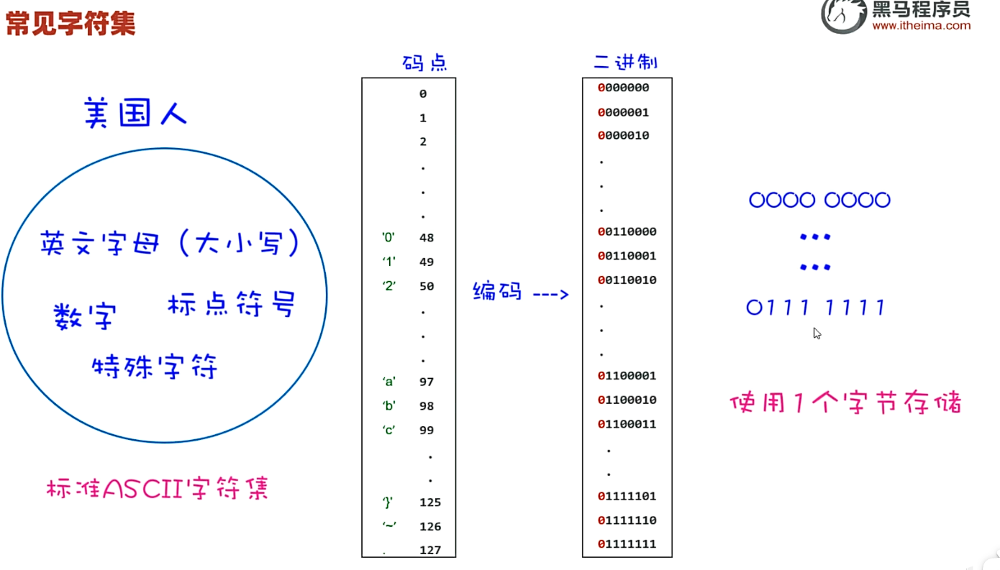
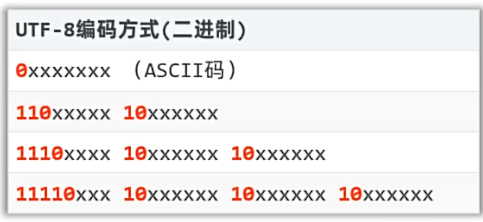
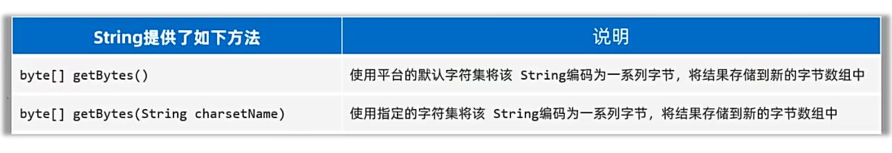
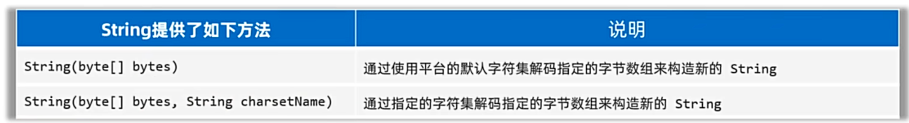

## 一、常见字符集

* ASCII：美国标准信息交换码，包括英文、符号等。
  * 标准ASCII码中，使用一个字节存储一个字符，首位是0，因此总共可存128个字符。对于美国人来说足够使用。
* GBK：汉字编码字符集，GBK中一个中文字符编码成两个字节的形式存储。
  * GBK兼容了ASCII字符集。
  * GBK编码中，首位是1，因此总共可存32768个字符。 并且首位是1，便于区分汉字和英文。
* Unicode：万国码，由国际组织制定，可以容纳世界上所有的文字、符号。
* UTF-8：Unicode字符集的一种编码方案，采取可变长编码方案，共四个长度区：一个字节、两个字节、三个字节、四个字节。
  * 英文字符、数字只占一个字节（兼容ASCII编码），汉字字符占用3个字节。
    
* **注意：**
  * **我们在日常开发中使用UTF-8编码。**
  * **字符编码时使用的字符集和解码时使用的字符集一定要保持一致，否则会出现乱码！！**
  * **英文、数字一般不会乱码，因为很多字符集都兼容了ASCII编码。**
## 二、使用程序对字符进行编码和解码
* 对于字符的编码：

* 对于字符的解码：
 
