## 一、认识IO流：
* 按照流的方向：
  * I指Input，输入流：负责把数据读到内存中(InputStream)
  * O指Output，输出流：负责写数据出去(OutputStream)
* 按照流的内容：
  * 字节流：适合操作所有类型的文件(Reader)
  * 字符流：适合操作文本文件(Writer)
  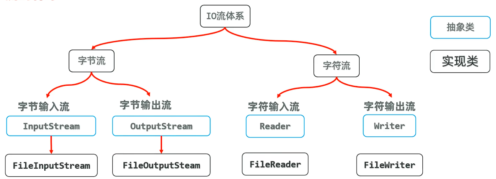
## 二、FileInputStream(文件字节输入流)：
* 作用：以内存为基准，可以把磁盘文件中的数据以字节的形式读入内存。
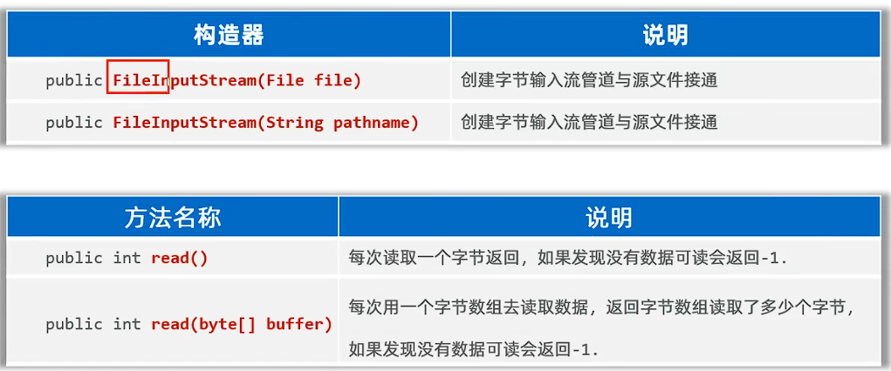
* 该方法只能读取小型文件，大型文件会导致内存溢出
例子：
```java
public class FileInputStreamDemo1 {
    public static void main(String[] args) throws IOException {
        //掌握文件字节输入流读取文件的字节数组到内存里来
        //1.创建文件字节输入流管道与文件对象接通
        //InputStream  is = new FileInputStream(new File("File-IO/src/HelloWorld.txt"));//此处可以不new文件对象
        InputStream  is = new FileInputStream("File-IO/src/HelloWorld.txt");
        //2.读取文件中的字节并输出（每次读取一个字节）
        //定义一个变量存储每次读取到的字节
//        int b;
//        while ((b = is.read()) != -1){
//            System.out.print((char)b);
//        }
        //上述代码存在的问题：性能差，且读取汉字会乱码
        //2.读取文件中的字节并输出（每次读取多个字节）
        //每次读取多个字节，性能得到提升，减少硬盘与内存交互的次数，提升性能
        //定义一个字节数组，每次读取多个字节到数组里
        //如果读取到文件末尾，返回-1
//        byte[] bs = new byte[1024];
//        //定义一个变量记录每次读取的字节个数
//        int len;
//        while ((len = is.read(bs)) != -1){
//            //把读取到的字节数组转成字符串输出
//            System.out.print(new String(bs,0,len));//指从第0位（第一个）字节开始，读取len个字节
//            //不要换行，才会按原文件格式输出
//        }
        //上述方法依然无法解决读取汉字乱码问题
        //3.读取文件的所有字节,避免汉字乱码
        byte[] bs = is.readAllBytes();
        String s = new String(bs);
        System.out.println(s);
    }
}
```
## 三、FileOutputStream(文件字节输出流)：
* 作用：以内存为基准，把内存中的数据以字节的形式写出进磁盘文件中。
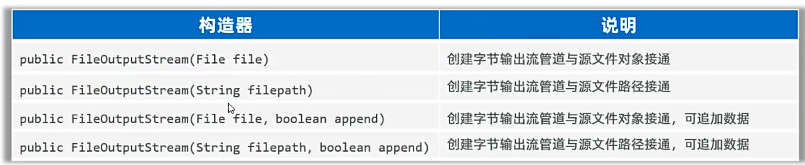
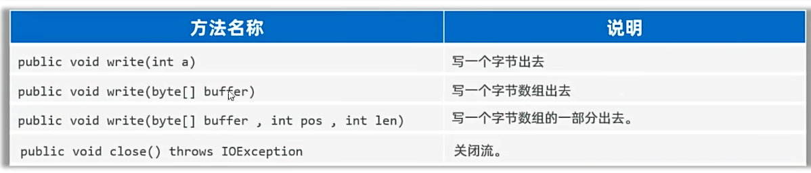
例子：
```java
    public static void main(String[] args) throws Exception {
        //文件字节输出流
        //1.创建文件字节输出流管道与文件对象接通
        //OutputStream os = new FileOutputStream("File-IO/src/HelloWorld.txt");//覆盖管道
        OutputStream os = new FileOutputStream("File-IO/src/HelloWorld.txt",true);//追加管道
        //2.写出数据
//        os.write('a');
//        os.write(97);
//        os.write('人');//乱码
        //3.写字节数组
        byte[] bs = {67,76,65,78,78,65,68};
        byte[] bs1 = {59};
        byte[] bs2 = {99,108,97,110,110,97,100};
        os.write("\r\n".getBytes());
        os.write(bs);
        os.write(bs1);
        os.write(bs2);
        os.write("\r\n".getBytes());//\r\n换行,\r是回车
        os.write("团子大家族".getBytes());//将字符串转为字节数组，写出进文件
        os.write("\r\n".getBytes());
        os.write("团子大家族".getBytes(), 0, 6);//输出前6个字符
        os.close();
    }
```
## 四、文件复制：
* 任何的文件底层都是字节，字节流做复制，是一字不漏地转移完全部字节，只要复制后地文件格式一致就没问题。
例子：
```java
public class FileCopyDemo1 {
    public static void main(String[] args) {
        //学习文件的复制
        //源文件：D:\l\Pictures\Saved Pictures\伊蒂达.jpg
        //目标文件：D:\idea\code\Java\File\伊蒂达Copy.jpg（复制文件时一定要带上文件名，Java无法自动生成文件名）
        try {
            copyFile("D:\\l\\Pictures\\Saved Pictures\\伊蒂达.jpg", "D:\\idea\\code\\Java\\File\\伊蒂达Copy.jpg");
        } catch (IOException e) {
            e.printStackTrace();
        }

    }
    public static void copyFile(String srcPath, String destPath) throws IOException {
        //1.创建一个输入流和源文件接通
        InputStream is = new FileInputStream(srcPath);
        //2.创建一个输出流和目标文件接通
        FileOutputStream fos = new FileOutputStream(destPath);
        //3.读写数据
        //定义一个字节数组
        byte[] flush = new byte[1024];
        //定义一个变量记录每次读取到的字节个数
        int len = 0;
        while ((len = is.read(flush)) != -1){
            fos.write(flush, 0, len);//读取多少字节，就写入多少字节
        }
        System.out.println("复制完成");
    }
}
```
## 五、资源释放方案：
* **1.使用try-catch-finally语句，在finally中释放资源**
 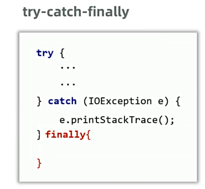
  * finally代码区的特点：无论try代码区的程序是正常执行，或是出现异常，finally代码区都会执行，除非JVM终止。
  * 作用：一般用于程序执行完成后进行资源释放操作（专业做法）。
* **2.由于try-catch-finally语句很臃肿，JDK7后使用try-with-resources语句，在try代码区释放资源**
  * try中只能放置资源对象，使用完成后自动调用close方法释放资源。
  * 资源是指最终实现了AutoCloseable接口的类对象。 
例子
```java
public class FileCopyDemo1 {
    public static void main(String[] args) {
        //学习文件的复制
        //源文件：D:\l\Pictures\Saved Pictures\伊蒂达.jpg
        //目标文件：D:\idea\code\Java\File\伊蒂达Copy.jpg（复制文件时一定要带上文件名，Java无法自动生成文件名）
        try {
            copyFile("D:\\l\\Pictures\\Saved Pictures\\伊蒂达.jpg", "D:\\idea\\code\\Java\\File\\伊蒂达Copy.jpg");
        } catch (IOException e) {
            e.printStackTrace();
        }

    }
    public static void copyFile(String srcPath, String destPath) throws IOException {
        //        try {
//            //1.创建一个输入流和源文件接通
//            is = new FileInputStream(srcPath);
//            //2.创建一个输出流和目标文件接通
//            fos = new FileOutputStream(destPath);
//            //3.读写数据
//            //定义一个字节数组
//            byte[] flush = new byte[1024];
//            //定义一个变量记录每次读取到的字节个数
//            int len = 0;
//            while ((len = is.read(flush)) != -1) {
//                fos.write(flush, 0, len);//读取多少字节，就写入多少字节
//            }
//            System.out.println("复制完成");
//        } catch (IOException e) {
//            throw new RuntimeException(e);
//        } finally {
//            if (fos != null) {
//                fos.close();
//            }
//            if (is != null) {
//                is.close();//fos，fis是try中的对象，若要调用，需要在try外面定义
//            }
//        }
        //上述资源释放方式很臃肿，JDK7后可以使用try-with-resource：
        try ( //try中只能放置资源对象，使用完成后自动调用close方法释放资源
              //1.创建一个输入流和源文件接通
                InputStream is = new FileInputStream(srcPath);
              //2.创建一个输出流和目标文件接通
                FileOutputStream fos = new FileOutputStream(destPath)) {
            //3.读写数据
            //定义一个字节数组
            byte[] flush = new byte[1024];
            //定义一个变量记录每次读取到的字节个数
            int len = 0;
            while ((len = is.read(flush)) != -1) {
                fos.write(flush, 0, len);//读取多少字节，就写入多少字节
            }
            System.out.println("复制完成");
        } catch (IOException e) {
            throw new RuntimeException(e);
        }
    }
}
```
## 六、文件字符输入流：
* 作用：以内存为基准，可以把文件中的数据以字符的形式读入到内存中。
 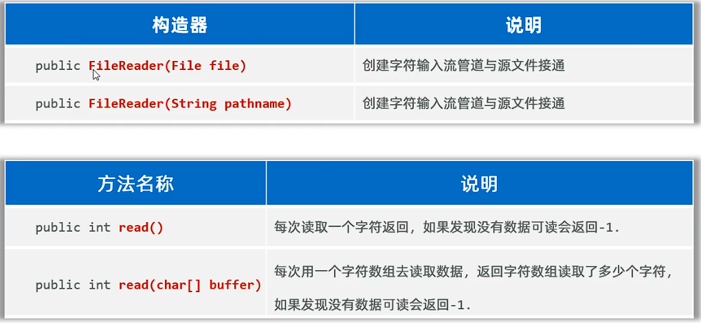
例子：
```java
public static void main(String[] args) {
        //掌握文件字符输入流读取字符内容到程序中来
        try (
                //1.创建文件字符输入流对象
                Reader fr = new FileReader("File-IO/src/HelloWorld.txt")) {
            //2.定义一个字符数组，每次读取多个字符
            char[] chars = new char[1024];
            int len;//定义一个变量记录每次读取的字符个数
            while ((len = fr.read(chars)) != -1) {
                System.out.print(new String(chars, 0, len));
            }
            //文件字符输入流每次读取多个字符，性能好，而且读取中文不会乱码
        } catch (Exception e) {
            e.printStackTrace();
        }
    }
```
## 七、文件字符输出流：
* 作用：以内存为基准，可以把内存中的数据以字符的形式写出到文件中。
  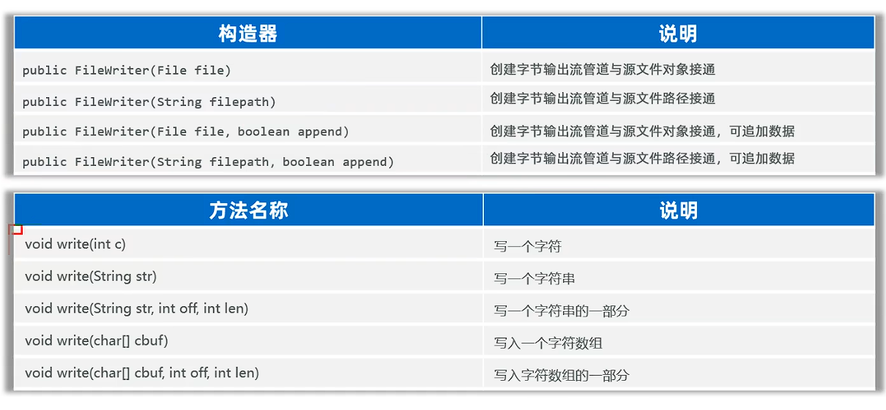
* 注意事项：
  * 字符输出流写出数据后，必须刷新流，或者关闭流，写出去的数据才会生效。
   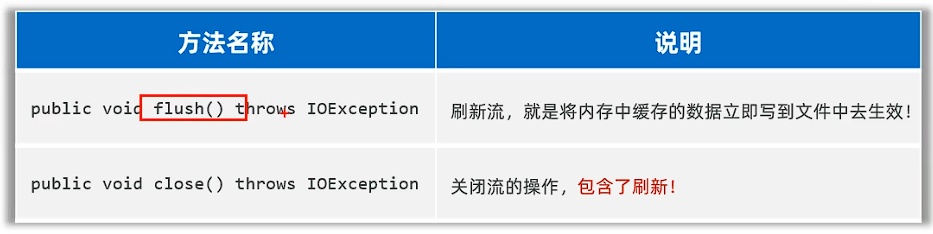
例子：
```java
 public static void main(String[] args) {
        //掌握文件字符输出流写出字符内容到文件中
        //1.创建文件字符输出流对象，指定写出的目的地
        try (
                Writer fw = new FileWriter("File-IO/src/HelloWorld.txt", true)){
            //2.写出字符
            fw.write("\r\n");//写出一个换行符
            fw.write('a');//写出一个字符
            fw.write("\r\n");//写出一个换行符
            fw.write(97);//写出一个字符的ASCII码
            fw.write("\r\n");//写出一个换行符
            fw.write('渚');//写出一个中文字符
            fw.write("\r\n");//写出一个换行符
            fw.write("hello world");//写出一个字符串
            fw.write("\r\n");//写出一个换行符
            char[] c = new char[]{'a', 'b', 'c'};
            fw.write(c);//写出一个字符数组
            fw.write("\r\n");//写出一个换行符
            fw.write(c, 0, 2);//写出一个字符数组的指定部分
            fw.write("\r\n");
            fw.write("HelloWorld", 0, 5);//写出一个字符串的指定部分
            //3.刷新缓冲区，将缓冲区的数据写出目的地
            fw.flush();//刷新缓冲区后，流还能继续使用
        }catch( Exception e ){
            e.printStackTrace();
        }
    }
```
## 八、缓冲字节流：
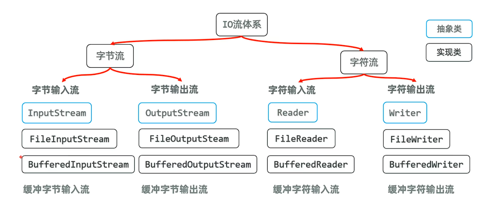
* 作用：可以提高字节流读取数据的性能。
* 原理：缓冲字节输入流内部维护了一个缓冲区，缓冲区大小默认为8KB。缓冲字节输出流也一样。
 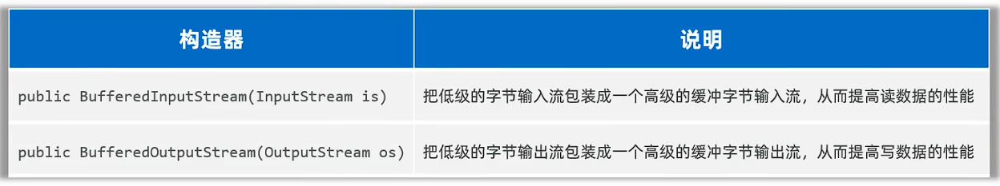
 例子：
```java
public class BufferedInputStreamDemo {
    public static void main(String[] args) {
        //学习缓冲字节流
        //源文件：D:\l\Pictures\Saved Pictures\伊蒂达.jpg
        //目标文件：D:\idea\code\Java\File\伊蒂达Copy.jpg（复制文件时一定要带上文件名，Java无法自动生成文件名）
        try {
            copyFile("D:\\l\\Pictures\\Saved Pictures\\伊蒂达.jpg", "D:\\idea\\code\\Java\\File\\伊蒂达Copy.jpg");
        } catch (IOException e) {
            e.printStackTrace();
        }

    }
    public static void copyFile(String srcPath, String destPath) throws IOException {
        try ( //try中只能放置资源对象，使用完成后自动调用close方法释放资源
              //1.创建一个输入流和源文件接通
              //低级字节输入流的性能低，可将其包装成缓冲字节输入流
              InputStream is = new FileInputStream(srcPath);
              InputStream bis = new BufferedInputStream(is);
              //2.创建一个输出流和目标文件接通
              OutputStream fos = new FileOutputStream(destPath);
              //将输出流包装成缓冲字节输出流
              OutputStream bos = new BufferedOutputStream(fos);
        ) {
            //3.读写数据
            //定义一个字节数组
            byte[] flush = new byte[1024];
            //定义一个变量记录每次读取到的字节个数
            int len = 0;
            while ((len = is.read(flush)) != -1) {
                fos.write(flush, 0, len);//读取多少字节，就写入多少字节
            }
            System.out.println("复制完成");
        } catch (IOException e) {
            throw new RuntimeException(e);
        }
    }
}
```
## 九、缓冲字符流：
* 缓冲字符输入流作用：自带8k缓冲区，可以提高字符输入流读取数据的性能。输出流也一样
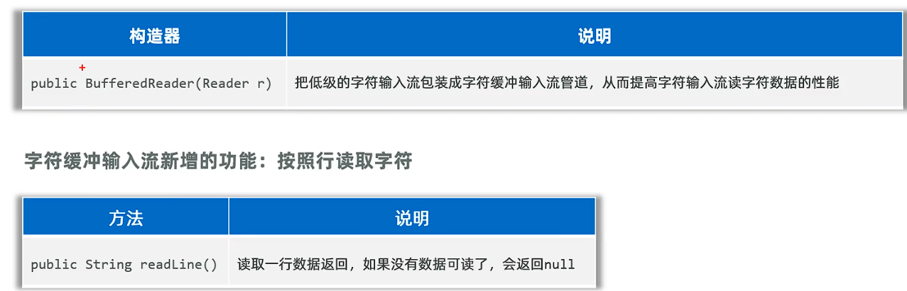
例子：
```java
public class BufferWriteDemo1 {
    public static void main(String[] args) {
        //掌握文件缓冲字符输出流写出字符内容到文件中
        //1.创建文件字符输出流对象，指定写出的目的地
        try (
                Writer fw = new FileWriter("File-IO/src/HelloWorld.txt", true);
                //创建缓冲字符输出流对象，把字符输出流作为构造参数传递给缓冲字符输出流对象
                BufferedWriter bw = new BufferedWriter(fw);
        ) {
            //2.写出字符
            bw.newLine();//换行
            bw.write('a');//写出一个字符
            bw.newLine();//换行
            bw.write(97);//写出一个字符的ASCII码
            bw.newLine();//换行
            bw.write('渚');//写出一个中文字符
            bw.newLine();//换行
            bw.write("hello world");//写出一个字符串
            bw.newLine();//换行
            char[] c = new char[]{'a', 'b', 'c'};
            bw.write(c);//写出一个字符数组
            bw.newLine();//换行
            bw.write(c, 0, 2);//写出一个字符数组的指定部分
            bw.write("\r\n");
            bw.write("HelloWorld", 0, 5);//写出一个字符串的指定部分
            //3.刷新缓冲区，将缓冲区的数据写出目的地
            bw.flush();//刷新缓冲区后，流还能继续使用
        } catch (Exception e) {
            e.printStackTrace();
        }
    }
}
```
* **建议使用字节缓冲输入流、字节缓冲输出流，结合字节数组的方式，目前是最优组合。**
## 十、其他流：
* 1.字符输入转换流：
  * 解决不同编码时，字符流读取文本内容乱码问题。
  * 解决思路：先获取文件的原始字节流，再将其按照真实的字符集编码转成字符输入流，这样字符输入流中的字符就不乱码了。
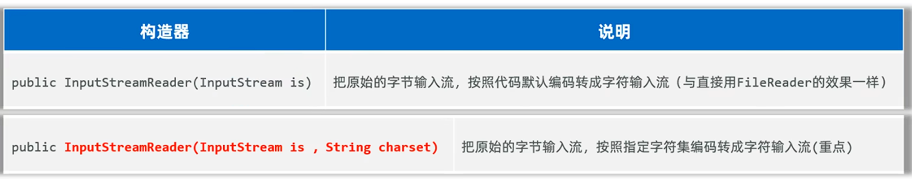
例子：
```java
public static void main(String[] args) {
        //演示不同编码读取乱码问题
        //解决字符乱码问题
        try (
                //先获取文件的原始字节流
                InputStream is = new FileInputStream("File-IO/src/com/lbh/HelloWorld2.txt");
                //1.创建文件字符输入流对象
                Reader fr = new InputStreamReader(is, "GBK");
                //2.创建缓冲字符输入流对象包装低级的字符输入流
                BufferedReader br = new BufferedReader(fr);
        ) {
            //缓冲字符输入流可按行读取
            String line;
            while ((line = br.readLine()) != null) {
                System.out.println(line);
            }
            //文件字符输入流每次读取多个字符，性能好，而且读取中文不会乱码
        }catch (Exception e) {
            e.printStackTrace();
        }
    }
```
* 2.打印流（PrintStream/PrintWriter）
  * 作用：打印流可以实现更方便、更高效的打印数据出去，实现打印啥出去就是什么出去。
  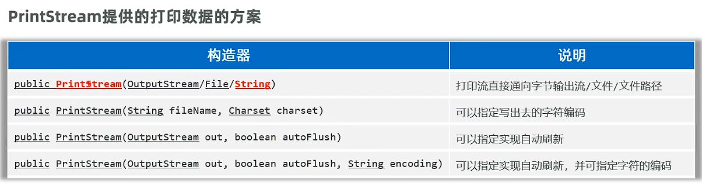
  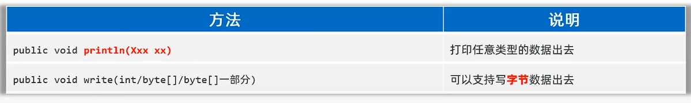
例子：
```java
public static void main(String[] args) {
        //使用打印流
        try(PrintStream ps = new PrintStream("File-IO/src/com/lbh/HelloWorld2.txt")){
            ps.println("hello world");
            ps.println(123);
            ps.println(true);
            ps.println('a');
            ps.println("你好");

        } catch (FileNotFoundException e) {
            throw new RuntimeException(e);
        }
    }
```
* 3.数据流（DataInputStream/DataOutputStream） 
  * 数据输出流：允许把数据和类型一并写出去。
  
  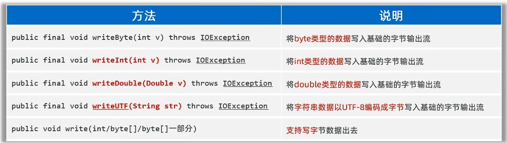
输出流例子：
```java
 public static void main(String[] args) {
        //认识数据输入输出流：
        try(
                DataOutputStream dos = new DataOutputStream(new FileOutputStream("File-IO/src/HelloWorld3.txt"));
                ){
            dos.writeByte(100);
            dos.writeInt(100);
            dos.writeLong(100);
            dos.writeUTF("你好");
            dos.writeBoolean(true);
            dos.writeChar('a');

        } catch (IOException e) {
            throw new RuntimeException(e);
        }
    }
```
输入流例子：
```java
public static void main(String[] args) {
        //认识数据输入输出流：
        try(
                DataInputStream dis = new DataInputStream(new FileInputStream("File-IO/src/HelloWorld3.txt"));
        ){
            System.out.println(dis.readByte());
            System.out.println(dis.readInt());
            System.out.println(dis.readLong());
            System.out.println(dis.readUTF());
            System.out.println(dis.readBoolean());
            System.out.println(dis.readChar());

        } catch (IOException e) {
            throw new RuntimeException(e);
        }
    }
```
## 十一、IO框架
* 框架是一个预先写好的代码库或一组工具，旨在简化和加速开发过程。
* 框架的形式，一般是把类、接口等编译成class的形式，再压缩成jar包发行。
* IO框架：封装了Java提供的对文件、数据进行操作的代码，对外提供了更简单的方式来对文件进行操作，对数据进行读写。
 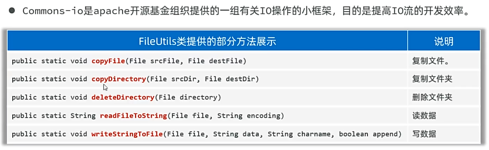
 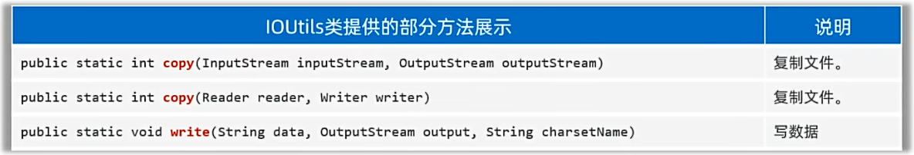  
