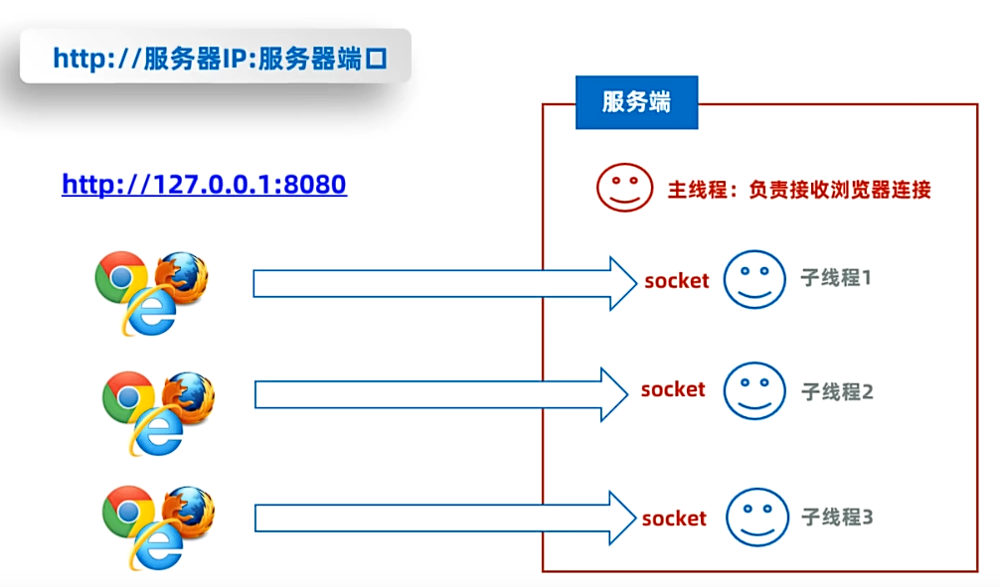

## 一、网络编程

* 可以让设备中的程序与网络上其他设备中的程序进行数据交互的技术（实现网络通信）。
* **基本的通信架构：**
  * 基本的通信架构有两种形式：CS架构（Client-Server架构）和BS架构（Browser-Server架构）。
  * CS架构：
    
  * BS架构：
    
* **java的net包下提供了网络编程的解决方案。**

## 二、网络通信三要素

* **IP地址**：设备在网络中的地址，是设备在网络中的唯一标识符，全程为“互联网协议地址”。
  * 目前，被广泛采用的IP地址为
  * **IPv4：** Internet Protocol version 4，使用32位地址，通常以点分十进制表示。
    
  * **IPv6**：Internet Protocol version 6，使用128位地址，分为8段，每段每四位编码成一个十六进制位表示，每段之间用冒号分开，将这种方式称之为冒分十六进制。
    
  * **IP域名：** 用于在互联网上识别和定位网站的人类可读名称。（例如：www.baidu.com）
    * **DNS域名解析：** 互联网中用于将域名转换为对应IP地址的分布式命名系统。它充当了互联网的“电话簿”，将易记的域名映射到数字化的IP地址，使得用户可以通过域名来访问网站和其他网络资源。
  * **公网ip**：全称是Global Internet Protocol，是互联网协议，可以连接到互联网的IP地址。
  * **局域网ip**：全称是Local Area Network Protocol，是局域网协议，只能在组织机构内部使用的IP地址。例如：192.168.开头的就是常见的局域网地址，范围为192.168.0.0~192.168.255.255。专门为组织机构内部使用。
  * **本机IP地址**：127.0.0.1和localhost: 就是本机的IP地址，只会寻找当前程序所在的主机。
  * **IP常用命令：**
    * ipconfig：查看本机IP地址。
    * ping IP地址：测试网络连通性。
* **InetAddress：** 代表IP地址。
  
* **端口号**：应用程序在设备中的唯一标识，标记正在计算机设备上运行的应用程序，被规定成一个16为的二进制，范围是0~65535。
  * **端口分类：**
    周知端口：01023，预先定义的知名应用占用（Http占用80，FTP占用21）；
    注册端口：102449151，分配给用户进程或某些应用程序；
    动态端口：49152~65535，不固定分配给某种进程，而是动态分配。
  * **注意：** 开发程序时一般使用注册端口，且同一个设备中不能同时出现两个程序的端口好一样，否则报错。
* **协议**：网络通信的设备，实现规定的连接规则，以及传输数据的规则被称之为网络通信协议。为了让全球的网络设备都能互通，需要制定统一的标准。
  * 开放式网络的参考模型：
    * OSI网络参考模型：全球网络互联标准。
    * TCP/IP网络参考模型：事实上的国际标准。
      
  * **UDP(User Datagram Protocol)协议：** 用户数据报协议。
    * 特点：无连接，不可靠通信，通信效率高。
    * 不是先建立连接，数据按照包发，一包数据包括：自己的ip、端口、目标ip、端口和数据（限制在64KB内）等。发送方不管对方是否在线，数据在中间丢失也不管，如果对方收到数据也不返回确认，故而不可靠。
    * 应用场景：视频直播、语音通信
  * **TCP(Transmission Control Protocol)协议：** 传输控制协议。
    * 特点：面向连接、可靠通信、通信效率低。
    * TCP的最终目的：要保证在不可靠的信道上实现可靠的数据传输。
    * 实现可靠传输步骤：三次握手建立连接，传输数据进行确认，四次挥手断开连接。
    * 应用场景：网页、文件下载、支付
      
      

## 三、UDP的实现

* Java提供了java.net.DatagramSocket类用于实现UDP协议。
  
  一发一收例子：

```java
//客户端
public class UDPClientDemo1 {
    public static void main(String[] args) throws Exception {
        System.out.println("客户端启动");
        //模拟UDP通信：客户端
        //1.创建发送端对象（默认分配端口）(发球的人)
        DatagramSocket socket =   new DatagramSocket();//动态分配端口
        //2.船舰数据包对象，封装数据(球拍)
        byte[] data = "HelloWorld".getBytes();
        //3.发送数据包
        /*
        * 参数1：数据
        * 参数2：数据长度
        * 参数3：接收方地址
        * 参数4：接收方端口号
         */
        DatagramPacket packet = new DatagramPacket(data,  data.length, InetAddress.getLocalHost(), 8080);
        socket.send(packet);
        socket.close();//关闭管道
    }
}
```

```java
//服务端
public class UDPServerDemo2 {
    public static void main(String[] args) throws Exception {
        System.out.println("服务端启动");
        //模拟UDP通信，服务端
        //1.创建服务端对象（接球）
        DatagramSocket socket = new DatagramSocket(8080);
        //2.创建一个数据包对象，封装数据（球拍）
        byte[] buf = new byte[1024 * 64];
        DatagramPacket packet = new DatagramPacket(buf, buf.length);
        //3.接收数据
        socket.receive(packet);
        //4.获取数据
        //获取数据长度
        int length = packet.getLength();
        String data = new String(buf,  0, length);
        System.out.println("服务端收到" + data);
        //5.获取ip
        String address = packet.getAddress().getHostAddress();
        System.out.println("服务端收到" + address + "发来的端口：" + packet.getPort());
        socket.close();//关闭管道
    }
}
```

多发多收例子：

```java
//客户端
public class UDPClientDemo1 {
    public static void main(String[] args) throws Exception {
        System.out.println("客户端启动");
        //模拟UDP通信：客户端（多发多收）
        //1.创建发送端对象（默认分配端口）(发球的人)
        DatagramSocket socket =   new DatagramSocket();//动态分配端口
        //2.船舰数据包对象，封装数据(球拍)
        Scanner sc = new Scanner(System.in);
        while (true) {
            System.out.println("请输入要发送的数据：");
            String line = sc.nextLine();
            if ("exit".equals(line)) {
                System.out.println("客户端退出");
                break;
            }
            byte[] data = line.getBytes();
            //3.发送数据包
            DatagramPacket packet = new DatagramPacket(data,  data.length, InetAddress.getLocalHost(), 8080);
            socket.send(packet);
        }
        socket.close();
    }
}
```

```java
public class UDPServerDemo2 {
    public static void main(String[] args) throws Exception {
        System.out.println("服务端启动");
        //模拟UDP通信，服务端（多发多收）
        //1.创建服务端对象（接球）
        DatagramSocket socket = new DatagramSocket(8080);
        //2.创建一个数据包对象，封装数据（球拍）
        byte[] buf = new byte[1024 * 64];
        DatagramPacket packet = new DatagramPacket(buf, buf.length);
        while (true) {
            //3.接收数据
            socket.receive(packet);//等待接收数据
            //4.获取数据
            //获取数据长度
            int length = packet.getLength();
            String data = new String(buf,  0, length);
            System.out.println("服务端收到：" + data);
            //5.获取ip
            String address = packet.getAddress().getHostAddress();
            System.out.println("服务端收到：" + address + "发来的端口：" + packet.getPort());
            System.out.println("================");
        }
    }
}
```

## 四、TCP的实现

* Java提供了java.net.Socket类用于实现TCP协议的客户端。
  
* Java提供了java.net.ServerSocket类用于实现TCP协议的服务端。
  
  一发一收例子：

```java
 //服务端
 public class TCPServerSocket {
    public static void main(String[] args) throws Exception {
        //模拟TCP协议：服务端(一发一收)
        //1.创建服务端对象
        System.out.println("服务端启动");
        ServerSocket server = new ServerSocket(8080);
        //2.等待客户端的数据,阻塞式等待客户端连接，一旦客户端连接就会创建一个Socket对象，返回
        Socket socket = server.accept();
        //3.获取字节输入流
        InputStream is = socket.getInputStream();
        //4.把字节输入流转换成特殊数据输入流
        DataInputStream dis = new DataInputStream(is);
        //5.读取数据
        String data = dis.readUTF();
        String data2 = dis.readUTF();
        System.out.println("收到客户端：" + data2);
        System.out.println("收到客户端：" + data);
        //6.获取客户端ip和端口
        String ip = socket.getInetAddress().getHostAddress();
        System.out.println("客户端ip：" + ip);
        System.out.println("客户端端口：" + socket.getPort());
    }
}
```

```java
//客户端
public class TCPClientDemo1 {
    public static void main(String[] args) throws Exception {
        //模拟TCP通信：客户端(一发一收)
        System.out.println("客户端启动");
        //1.创建Socket管道对象，与服务器Socket建立连接
        Socket socket =new Socket("127.0.0.1",8080);
        //2.从Socket通信管道中得到一个字节输出流
        OutputStream os = socket.getOutputStream();
        //3.把字节输出流包装成特殊数据流(服务器在接收流时应当一一对应)
        DataOutputStream dos = new DataOutputStream(os);
        dos.writeUTF("Hello,Server");
        dos.writeUTF("团子大家族");
        //4.关闭管道
        socket.close();
    }
}
```

多发多收例子：

```java
//服务端
public class TCPServerSocket {
    public static void main(String[] args) throws Exception {
        //模拟TCP协议：服务端(多发多收)
        //1.创建服务端对象
        System.out.println("服务端启动");
        ServerSocket server = new ServerSocket(8080);
        //2.等待客户端的数据,阻塞式等待客户端连接，一旦客户端连接就会创建一个Socket对象，返回
        Socket socket = server.accept();
        //3.获取字节输入流
        InputStream is = socket.getInputStream();
        //4.把字节输入流转换成特殊数据输入流
        DataInputStream dis = new DataInputStream(is);
        while (true) {
            //5.读取数据
            String data = dis.readUTF();//等待客户端发送的数据
            System.out.println("收到客户端：" + data);
            //6.获取客户端ip和端口
            String ip = socket.getInetAddress().getHostAddress();
            System.out.println("客户端ip：" + ip);
            System.out.println("客户端端口：" + socket.getPort());
            System.out.println("================================");
        }
    }
}  
```

```java
public class TCPClientDemo1 {
    public static void main(String[] args) throws Exception {
        //模拟TCP通信：客户端(多发多收)
        System.out.println("客户端启动");
        //1.创建Socket管道对象，与服务器Socket建立连接
        Socket socket =new Socket("127.0.0.1",8080);
        //2.从Socket通信管道中得到一个字节输出流
        OutputStream os = socket.getOutputStream();
        //3.把字节输出流包装成特殊数据流(服务器在接收流时应当一一对应)
        DataOutputStream dos = new DataOutputStream(os);
        Scanner sc = new Scanner(System.in);
        while (true) {
            System.out.println("请输入要发送的内容：");
            String line = sc.nextLine();
            dos.writeUTF(line);
            if ("exit".equals(line)) {
                System.out.println("客户端退出");
                break;
            }
            dos.flush();
        }
        //4.关闭管道
        dos.close();
        socket.close();
    }
}
```

## 五、TCP同时接收多个客户端数据

* 上述例子中的TCP协议只有一个主线程，因此只能和一个客户端通信
* 实现多个客户端通信的思路：引入多线程：
  
  例子：

```java
 //客户端
 public class TCPClientDemo1 {
    public static void main(String[] args) throws Exception {
        //模拟TCP通信：客户端(多发多收)支持多个客户端开发
        System.out.println("客户端启动");
        //1.创建Socket管道对象，与服务器Socket建立连接
        Socket socket =new Socket("127.0.0.1",8080);
        //2.从Socket通信管道中得到一个字节输出流
        OutputStream os = socket.getOutputStream();
        //3.把字节输出流包装成特殊数据流(服务器在接收流时应当一一对应)
        DataOutputStream dos = new DataOutputStream(os);
        Scanner sc = new Scanner(System.in);
        while (true) {
            System.out.println("请输入要发送的内容：");
            String line = sc.nextLine();
            dos.writeUTF(line);
            if ("exit".equals(line)) {
                System.out.println("客户端退出");
                break;
            }
            dos.flush();
        }
        //4.关闭管道
        dos.close();
        socket.close();
    }
}
```

```java
//服务端
public class TCPServerSocket {
    public static void main(String[] args) throws Exception {
        //模拟TCP协议：服务端(多发多收)支持多个客户端开发
        //1.创建服务端对象
        System.out.println("服务端启动");
        ServerSocket server = new ServerSocket(8080);
        while (true) {
            //2.等待客户端的数据,阻塞式等待客户端连接，一旦客户端连接就会创建一个Socket对象，返回
            Socket socket = server.accept();
            System.out.println("一个客户端连接了" +  socket.getInetAddress().getHostAddress() + ":" + socket.getPort());
            //3.把这个客户端管道交给一个独立的子线程处理数据
            new ServerReader(socket).start();
        }
    }
}
```

```java
//服务端处理多人通信的线程池
public class ServerReader extends Thread{
    private Socket socket;

    public ServerReader(Socket socket) {
        this.socket = socket;
    }
    @Override
    public void run() {
        try {
            //3.获取字节输入流
            InputStream is = socket.getInputStream();
            //4.把字节输入流转换成特殊数据输入流
            DataInputStream dis = new DataInputStream(is);
            while (true) {
                //5.读取数据
                String data = dis.readUTF();//等待客户端发送的数据
                System.out.println("收到客户端：" + data);
                //6.获取客户端ip和端口
                String ip = socket.getInetAddress().getHostAddress();
                System.out.println("客户端ip：" + ip);
                System.out.println("客户端端口：" + socket.getPort());
                System.out.println("================================");
            }
        } catch (Exception e) {
            System.out.println("客户端已退出..."+ socket.getInetAddress().getHostAddress() + ":" + socket.getPort());
        }
    }
}
```

## 六、B/S架构的原理

* **B/S架构：** 服务器需要给浏览器响应http协议规定的数据格式，才能被浏览器识别显示。
  
* **Http协议规定：**相应给浏览器的数据格式必须满足以下格式：
  
* **使用线程池优化**
  
  例子：

```java
public class TCPServerSocket {
    public static void main(String[] args) throws Exception {
        //模拟TCP协议：熟悉B/S架构原理
        //1.创建服务端对象
        System.out.println("服务端启动");
        ServerSocket server = new ServerSocket(8080);
        while (true) {
            //2.等待客户端的数据,阻塞式等待客户端连接，一旦客户端连接就会创建一个Socket对象，返回
            Socket socket = server.accept();
            //创建线程池
            ExecutorService pool = new ThreadPoolExecutor(3, 10, 10, TimeUnit.SECONDS, new ArrayBlockingQueue<>(100), Executors.defaultThreadFactory(), new ThreadPoolExecutor.AbortPolicy());
            System.out.println("一个客户端连接了" +  socket.getInetAddress().getHostAddress() + ":" + socket.getPort());
            //3.把这个客户端管道交给一个独立的子线程处理数据(优化方案：把这个管道包装成一个任务交给线程池处理)
//            new ServerReader(socket).start();
            pool.execute(new ServerReader(socket));
        }
    }
}
```

```java
public class ServerReader extends Thread{
    private Socket socket;

    public ServerReader(Socket socket) {
        this.socket = socket;
    }
    @Override
    public void run() {
        try {
            //给当前浏览器管道响应数据
            OutputStream os = socket.getOutputStream();
            //通过字节输出流包装写出去数据给浏览器
            //把字节输出流包装成打印流
            PrintStream  ps = new PrintStream(os);
            ps.println("HTTP/1,1 200 OK");//响应行
            ps.println("Content-Type:text/html;charset=utf-8");//响应头
            ps.println();//空行
            ps.println("<html>");//响应体
            ps.println("<head><title>你好</title></head>");
            ps.println("<body>");
            ps.println("<h1>hello world</h1>");
            ps.println("</body>");
            ps.println("</html>");
            ps.flush();
            os.close();
            socket.close();
        } catch (Exception e) {
            System.out.println("客户端已退出..."+ socket.getInetAddress().getHostAddress() + ":" + socket.getPort());
        }
    }
}
```
