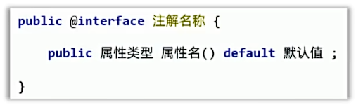
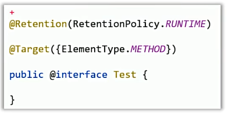
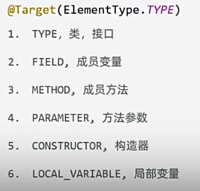
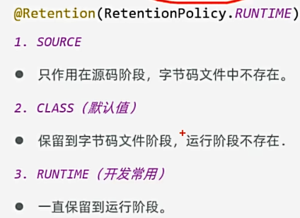
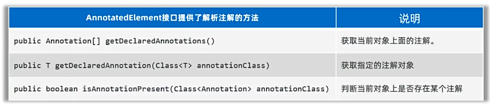
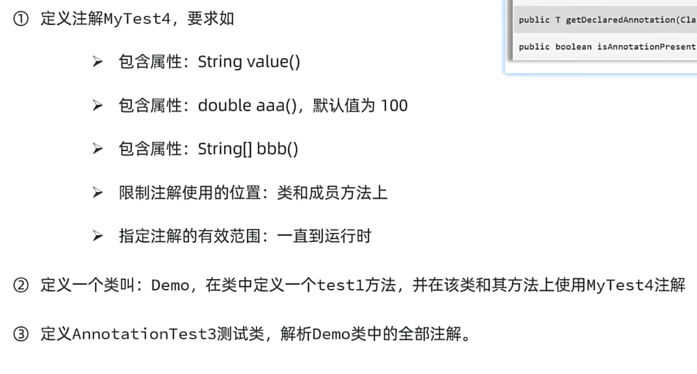
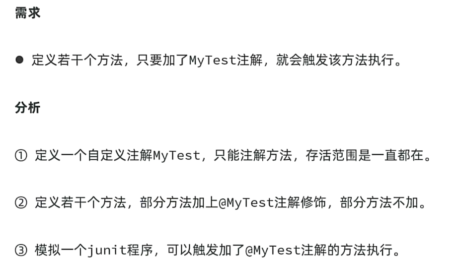
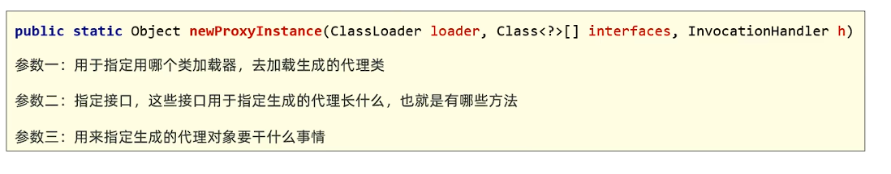

## 一、单元测试（JUnit）
* **就是针对最小的功能单元：方法，编写测试代码对其正确性进行测试**
* 之前的单元测试都是在main方法中测试，进而产生的问题：
  * 无法实现自动化测试，一个方法测试失败，可能影响其他方法测试。
  * 无法得到测试报告，需要程序员自己去观察测试结果。
* **Junit：**JAVA语言的单元测试框架，可以对方法进行测试。
  * 优点：
    * 可以灵活编写测试代码，可以针对某个方法执行测试，也支持一键完成对全部方法的自动化测试，且各自独立。
    * 无需程序员分析测试结果，自动生成测试报告。
* **使用Junit测试步骤：**
  * 将JUnit.jar导入项目中（Idea集成）。
  * 为需要测试的业务类，定义对应的测试类，并未每个业务方法，编写对应测试方法（公告、无参、无返回值）
  * 测试方法上必须声明@Test注解，测试方法中，编写代码调用被测试的业务方法进行测试。
  * 开始测试：选中测试方法，右键选择JUnit运行，如果通过是绿色，否则是红色。
## 二、反射
* **反射：** 加载类，并允许以编程的方式解剖类中的各个部分（成员变量、方法、构造器等）
  
* **反射需要掌握的知识：** 学习获取类的信息、操作它们
  * 1.反射第一步：加载类，获取类的字节码：Class对象：
    * Class c1 = Class.forName();
    * 调用Class提供的方法: public static Class forName(String package);
    * Object提供的方法: public Class getClass(); Class c3 = 对象.getClass();
  * 2.获取类的构造器：Constructor对象
  
  * 3.获取类的成员变量：Field对象
  * 4.获取类的成员方法：Method对象  
例子：
```java
public class ReflectDemo2 {
    @Test
    public void getClassInfo() {
        // 获取类的信息
        //1.获取Class对象，代表拿到类
        Class c1 = Student.class;
        System.out.println(c1.getName());//类的全名
        System.out.println(c1.getSimpleName());//类名
    }
    //2.获取类的构造器对象，并对其进行操作
    @Test
    public void getConstructor() throws Exception {
        //1.反射第一步：获取类的Class对象
        Class c1 = Student.class;
        //2.获取构造器对象
        Constructor[] constructors = c1.getDeclaredConstructors();//获取所有构造器
        for (Constructor constructor : constructors) {
            System.out.println(constructor.getName() + " ( " + constructor.getParameterCount() + " ) ");//获得构造器的名称和参数个数及其参数数量
        }
        //3.获取单个构造器
        Constructor constructors2 = c1.getDeclaredConstructor();//获取无参构造器
        System.out.println(constructors2.getName() + " ( " + constructors2.getParameterCount() + " ) ");
        Constructor constructors3 = c1.getDeclaredConstructor( String.class, Integer.class, Integer.class );//获取有参构造器
        System.out.println(constructors3.getName() + " ( " + constructors3.getParameterCount() + " ) ");
        //4.获取单个构造器创建对象
        Student student = (Student) constructors3.newInstance( "张三", 18, 100);
        System.out.println(student);
        //暴力反射：获取私有构造器创建对象
        Constructor constructor = c1.getDeclaredConstructor( Integer.class);
        constructor.setAccessible(true);
        Student student2 = (Student) constructor.newInstance( 18);
        System.out.println(student2);
    }
    //3.获取类的成员变量对象，并进行操作
    @Test
    public void getField() throws Exception {
        //1.获取类的Class对象
        Class c1 = Student.class;
        //2.获取成员变量对象
        Field[] field1 = c1.getDeclaredFields();
        for (Field field : field1) {
            System.out.println(field.getName() + " ( " + field.getType().getName() + " ) ");
        }
        //3.获取单个成员变量对象
        Field field2 = c1.getDeclaredField("name");
        System.out.println(field2.getName() + " ( " + field2.getType().getName() + " ) ");
        //4.获取成员变量的目的是取值和赋值
        Student s = new Student();
        field2.setAccessible(true);
        field2.set(s, "张三");
        System.out.println(field2.get(s));
    }
    //4.获取类的成员方法对象，并进行操作
    @Test
    public void getMethod() throws Exception {
        //1.获取类的Class对象
        Class c1 = Student.class;
        //2.获取成员方法对象
        Method[] methods = c1.getDeclaredMethods();
        for (Method method : methods) {
            System.out.println(method.getName() + " ( " + method.getParameterCount() + " ) ");
        }
        //3.获取单个成员方法对象
        Method method2 = c1.getDeclaredMethod("setName", String.class);
        System.out.println(method2.getName() + " ( " + method2.getParameterCount() + " ) ");
        //4.获取成员方法的目的是进行调用
        Student s = new Student();
        method2.setAccessible(true);
        method2.invoke(s, "李四");
        System.out.println(s);
    }
}
```
```java
public class Student {
    private String name;
    private Integer age;
    private Integer score;

    public Student() {
    }
    private Student( Integer age){
        this.age = age;
    }
    public Student(String name, Integer age, Integer score) {
        this.name = name;
        this.age = age;
        this.score = score;
    }

    @Override
    public String toString() {
        return "Student{" +
                "name='" + name + '\'' +
                ", age=" + age +
                ", score=" + score +
                '}';
    }

    public Integer getScore() {
        return score;
    }

    public void setScore(Integer score) {
        this.score = score;
    }

    public Integer getAge() {
        return age;
    }

    public void setAge(Integer age) {
        this.age = age;
    }

    public String getName() {
        return name;
    }

    public void setName(String name) {
        this.name = name;
    }
}
```
## 三、反射的作用
* 反射的作用是：
  * 可以得到一个类的全部成分然后操作。
  * 破坏封装
  * 绕过泛型约束
  * **适合做Java框架，基本上，主流的框架都会基于反射设计出通用功能。**
例子：
```java
public static void main(String[] args) throws Exception {
        //反射的作用
        //1.类的全部成分的获取
        //2.破坏封装性
        //3.绕过泛型约束
        ArrayList<String> list = new ArrayList<>();
        list.add("hello");
        list.add("world");
        list.add("java");
        //绕过泛型约束
        Class c = list.getClass();
        //获取ArrayList的add方法
        Method m = c.getDeclaredMethod("add", Object.class);
        //调用add方法
        m.invoke(list, 100);
        System.out.println(list);
    }
```
## 四、注解
* **注解：** Java中的特殊标记，如：@Override、@Test等。
* **作用：** 告诉其他程序根据注解信息来决定你怎么执行该程序。
* **注意：** 注解可以作用在类、构造器、方法、成员变量、参数上等位置。
* **自定义注解：** 自己定义的注解。
 
* **特殊属性名称：** value，如果注解中只有一个value属性，那么在使用的时候value可以省略不写。
* **注解的原理：**
  * 本质上是一个接口，Java中所有的注解都是继承了Annotation接口。
  * @注解(...)：其实就是一个实现类的对象，实现了该注解以及Annotation接口。
例子：
```java
public @interface A {
    public String value();
    public int age() default 18;
    public String[] address();
}
```
```java
@A(value="hello",age=20, address = {"北京","上海"})
public class AnnotationDemo1 {
}
```
## 五、元注解
* **元注解：**注解注解的注解
 
* **@Target：**
  * 作用：声明被修饰的注解可以用在什么地方 
   
例子：
```java
@Target(ElementType.TYPE)//只能注解类，该注解底层为数组，可指定多种元素类型
public @interface MyTest {
}
```
```java
@MyTest
public class AnnotationDemo2 {
//    @Test(报错)
    public static void main(String[] args) {
        //了解元注解
    }
}
```
* **@Retention：**
  * 作用：声明被修饰的注解被保留多长时间
    
## 六、注解的解析
 * 就是判断类、方法、成员变量上是否存在注解，并把注解里的内容解析出来。
 * 解析注解的指导思想：解析谁上面的注解，就应该先拿到谁。
 * 若要解析类上的注解，就应该先获取类的Class对象。再通过Class对象解析上面的注解。其他元素类型以此类推。
 * 这些元素类型都实现了AnnotatedElement接口，它们都拥有解析注解的能力。
  
解析注解案例：

例子：
```java
@Test
    public void test() throws Exception {
        //解析注解
        //1.获取类对象
        Class c1 = Demo.class;
        //2.使用isAnnotationPresent方法判断类上是否有注解MyTest2
        if (c1.isAnnotationPresent(MyTest2.class)) {
            //3.获取注解对象
            MyTest2 myTest2 = (MyTest2) c1.getDeclaredAnnotation(MyTest2.class);
            //4.获取注解中的值
            String[] address = myTest2.address();
            double prices = myTest2.price();
            String value = myTest2.value();
            //5.打印输出注解中的值
            System.out.println("address:" + Arrays.toString(address));
            System.out.println("price:" + prices);
            System.out.println("value:" + value);
        }
    }
    @Test
    public void test2() throws Exception {
        //1.获取go方法
        Class c1 = Demo.class;
        Method method = c1.getDeclaredMethod("go");
        if (method.isAnnotationPresent(MyTest2.class)) {
            MyTest2 myTest2 = method.getDeclaredAnnotation(MyTest2.class);
            String[] address = myTest2.address();
            double prices = myTest2.price();
            String value = myTest2.value();
            System.out.println("address:" + Arrays.toString(address));
            System.out.println("price:" + prices);
            System.out.println("value:" + value);
        }
    }
```
```java
@Target({ElementType.TYPE, ElementType.METHOD})//指定注解的保留位置为类和方法
@Retention(RetentionPolicy.RUNTIME)//指定注解的保留策略为运行时
public @interface MyTest2 {
    String value();
    double price() default 90.1;
    String[] address();
}
```
```java
@MyTest2(value = "hello",address = {"上海","北京"})
public class Demo {
    @MyTest2(value =  "world", address = {"安徽","江苏"})
    public void go(){
    }
}
```
## 七、注解的应用场景

```java
    public static void main(String[] args) throws Exception {
        //模拟测试注解
        AnnotationDemo4  annotationDemo4 = new AnnotationDemo4();
        //1.获取Class对象
        Class c = AnnotationDemo4.class;
        //2.获取方法对象
        Method[] m = c.getMethods();
        //3.遍历方法对象,判断上方法是否被MyTest3注解标注
        for (Method method : m) {
            if (method.isAnnotationPresent(MyTest3.class)) {
                //通过属性值来操作方法的执行次数
                MyTest3 myTest3 = method.getAnnotation(MyTest3.class);
                int count = myTest3.count();
                for (int i = 0; i < count; i++) {
                    //调用方法
                    method.invoke(annotationDemo4);
                }
            }
        }
    }
    @MyTest3
    public void test() throws Exception{
        System.out.println("test1");
    }
    @MyTest3( count = 5)
    public void test2() throws Exception{
        System.out.println("test2");
    }
```
```java
@Target(ElementType.METHOD)
@Retention(RetentionPolicy.RUNTIME)
public @interface MyTest3 {
    int count() default 1;
}
```
## 八、动态代理
* 对象的功能过多，可以通过代理的方式，转移部分职责。
* 对象有什么方法想被代理，代理就一定要有对应的方法。
* java.lang.reflect.Proxy类提供为对象产生代理对象的方法：
 
例子：
```java
//行为接口
public interface StarService {
    void sing(String song);
    String dance();
}
```
```java
public class Star implements StarService {
    private String name;

    @Override
    public void sing(String song) {
        System.out.println(this.name + "正在唱：" + song);
    }

    @Override
    public String dance() {
        System.out.println(this.name + "正在跳舞");
        return "谢谢";
    }

    public Star() {
    }

    public Star(String name) {
        this.name = name;
    }

    public String getName() {
        return name;
    }

    public void setName(String name) {
        this.name = name;
    }

    @Override
    public String toString() {
        return "Star{" +
                "name='" + name + '\'' +
                '}';
    }
}
```
```java
/*
  * 代理工具类：专门负责创建代理对象给别人使用
 */
public class ProxyUtil {
    //创建一个明星对象的代理对象返回。
    public static StarService createProxy(Star star){
        /*
        * 参数1：代理对象的类加载器,用于执行用哪个类加载器去加载生成的代理类。
        * 参数2：代理对象实现的接口,用于指定代理类需要实现的接口。
        * 参数3：代理对象处理逻辑,用于指定代理类需要如何代理。
         */
        StarService proxy = (StarService) Proxy.newProxyInstance(ProxyUtil.class.getClassLoader(),
                star.getClass().getInterfaces(), new InvocationHandler(){
                    @Override
                    public Object invoke(Object proxy, Method method, Object[] args) throws Throwable {
                        //用来声明代理对象需要执行的逻辑
                        //参数一：proxy接收到代理对象本身
                        //参数二：method表示正在被代理的方法
                        //参数三：args表示正在被代理的方法的参数
                        String methodName = method.getName();
                        if( "sing".equals(methodName)){
                            System.out.println("准备唱歌场地");
                        }else if( "dance".equals(methodName)){
                            System.out.println("准备跳舞场地");
                        }
                        //调用正在被代理的方法
                        //找真正的对象来执行被代理的行为
                        Object result = method.invoke(star, args);
                        return result;
                    }
                });
        return proxy;
    }
}
```
```java
public class Test {
    public static void main(String[] args) {
        //了解代理
        //准备明星对象
        Star star = new Star("刘德华");
        // 为明星创建专属代理对象
        StarService proxy = ProxyUtil.createProxy(star);
        proxy.sing("冰雨");
        System.out.println(proxy.dance());
    }
}
``` 