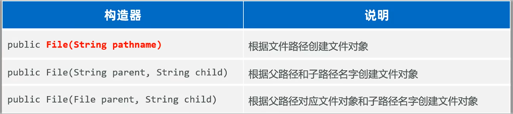

## 一、File
* File是Java.io包下的类，File类的对象，用于代表当前操作系统的文件（文件、或文件夹）。可调用其提供的方法对象文件进行操作。
* 创建File类的对象：
 
* File的注意事项：
  * File类既可以代表文件，也可以代表文件夹。
  * File封装的对象仅仅是一个路径名，这个路径可以是存在的，也允许不存在。
* 使用listFiles()的注意事项：
  * 主调是文件，或路径不存在，返回null。
  * 主调是文件夹，返回长度为0的数组。
  * **主调是有内容的文件夹时，将里面所有的以及文件和文件夹的路径放在File数组中返回。**
  * 主调是一个文件夹，里面有隐藏文件时，将里面所有的文件和文件夹的路径放在File数组中返回，包含隐藏文件。
  * 当主调是一个文件夹，但没有权限访问该文件夹时，返回null。
例子：
```java
public static void main(String[] args) throws IOException {
        //创建File创建对象代表文件，搞清楚文件的操作
        //1.创建File对象，若使用单个“\”，可能会与“\n”之类的符号混淆，建议使用“\\”
        File f1 = new File("D:\\idea\\code\\Java\\File\\7a156adb73e8fec8af6dd23418504a001549194870.jpg");
        System.out.println(f1.getName());//获取文件名
        System.out.println(f1.length());//获取文件大小:默认单位为字节
        //2.使用相对路径创建File对象
        //只要带盘符的都是绝对路径
        //相对路径：不带盘符，在该项目工程下寻找文件，用来寻找工程项目文件
        File f2 = new File("File-IO/src/com/lbh/FileDemo/HelloWorld.txt");
        System.out.println(f2.getName());
        //3.创建对象代表不存在的文件路径
        File f3 = new File("D:\\idea\\code\\Java\\File\\HelloWorld.txt");
        System.out.println(f3.exists());
        System.out.println(f3.createNewFile());
        //4.创建对象代表不存在的文件夹路径
        File f4 = new File("D:\\idea\\code\\Java\\File\\HelloWorld");
        System.out.println(f4.exists());
        System.out.println(f4.mkdir());//只能创建一级文件夹，多级需要用mkdirs();
        //5.删除文件
        System.out.println(f3.delete());
        //6.删除文件夹
        System.out.println(f4.delete());//删除文件夹时，文件夹下不能有文件，否则会报错
        //7.遍历目录下的文件：
        File f5 = new File("D:\\idea\\code\\java web\\canteenManage\\canteenManageIdea\\canteenManage\\src\\main\\resources\\mapper");
        String[] list = f5.list();
        if (list != null) {
            for (String s : list) {
                System.out.println(s);
            }
        }else{
            System.out.println("文件夹为空");
        }
        //8.拿取文件对象：
        File[] listFiles = f5.listFiles();
        if (listFiles != null) {
            for (File file : listFiles) {
                System.out.println(file.getName());//获取文件名
                System.out.println(file.getAbsolutePath());//获取文件绝对路径
            }
        }else{
            System.out.println("文件夹为空");
        }

    }
```
  