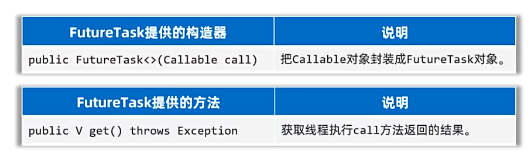
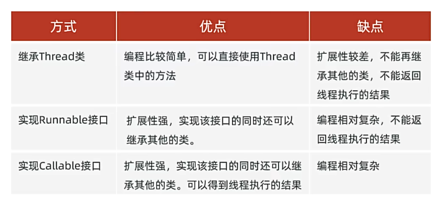
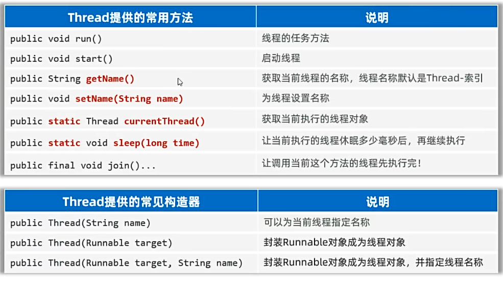

## 一、线程
* 线程（Thread）:是一个程序内部的一条执行流程。
* 如果一个程序只有一条执行流程，那么这个程序就是单线程程序。
* 多线程：多线程是指从软硬件上实现多条执行流程的技术（多条线程由CPU执行）。
## 二、创建线程 方式一：继承Thread类
* **步骤：**
  * 1.定义子类MyThread，继承Thread类，重写run()方法。
  * 2.创建MyThread对象。
  * 3.调用start()方法启动线程。（启动后还是执行run方法的）
* **优缺点：**
  * 优点：代码简单
  * 缺点：线程已经继承了Thread类，不能再继承其他类。不利于功能扩展。
* **注意事项：**
  * 线程启动必须调用start()方法，不能调用run()方法。
    * 直接调用run()方法，相当于调用普通方法，此时还是单线程执行。
    * 只有调用start()方法，才会启动一个新线程执行。
  * 不能把主线程任务放在启动子线程前。
例子：
```java
public class ThreadDemo1 {
    //main方法实际上是由一条主线程负责推进执行的
    public static void main(String[] args) {
        //认识多线程，创建多线程方式一：继承Thread类
        //4.创建一个线程对象，并启动线程
        MyThread t1 = new MyThread();
        //5.start方法启动线程
        t1.start();
        //写一个主线程任务
        for(int i = 0; i < 5; i++){
            System.out.println("主线程：" + i);
        }

    }
}
//1.定义一个子类继承Thread类,成为线程类
class MyThread extends Thread{
    //2.重写run方法，将此线程要执行的任务，放在run方法中
    @Override
    public void run(){
        //3.线程要执行的任务
        for(int i = 0; i < 5; i++){
            System.out.println("线程1：" + i);
        }
    }
}
```
## 三、创建线程 方式二：实现Runnable接口
* **步骤：**
  * 1.定义一个线程任务类实现Runnable接口，重写run()方法。 
  * 2.创建Runnable接口的实现类对象。
  * 3.把MyRunnable任务对象交给Thread处理
  * 4.调用线程对象的start()方法启动线程。
* **优缺点：**
  * 优点：任务类是实现接口，可以继续继承其他类，实现其他接口，扩展性强。
  * 缺点：需要多一个Runnable对象。
* **匿名内部类写法：**
  * 1.先创建一个Runnable的匿名内部类对象
  * 2.再把Runnable对象交给Thread处理
  * 3.调用线程对象的start()方法启动线程。
例子：
```java
 public class ThreadDemo2 {
    public static void main(String[] args) {
        //匿名内部类写法
        Runnable r2 = new Runnable(){
            @Override
            public void run(){
                for(int i = 0; i < 5; i++){
                    System.out.println("子线程4：" + i);
                }
            }
        };
        Thread t2 = new Thread(r2);
        t2.start();
        //可简化为：
        Thread t3 = new Thread(new Runnable(){
            @Override
            public void run(){
                for(int i = 0; i < 5; i++){
                    System.out.println("子线程3：" + i);
                }
            }
        });
        t3.start();
        //继续简化
        new Thread(() -> {
            for (int i = 0; i < 5; i++) {
                System.out.println("子线程2：" + i);
            }
        }).start();
        //创建多线程的方式二：实现Runnable接口
        //3.创建一个线程对象，并启动线程
        MyRunnable r1 = new MyRunnable();
        //4.将线程任务交给一个线程对象来处理
        Thread t1 = new Thread(r1);
        //5.start方法启动线程
        t1.start();
        //写一个主线程任务
        for(int i = 0; i < 5; i++){
            System.out.println("主线程：" + i);
        }
    }
    //1.定义一个线程任务类实现Runnable接口
    static class MyRunnable implements Runnable{
        //2.重写run方法，将此线程要执行任务放在run方法中
        @Override
        public void run() {
            for(int i = 0; i < 5; i++){
                System.out.println("子线程1：" + i);
            }
        }
    }
}
```
## 四、创建线程 方式三：实现callable接口
* **前两种创建方式存在的问题：**
  * 如果线程执行完毕有数据需要返回，他们重写的run方法无法直接返回结果。 
  * 利用callable接口、Future接口实现多线程，可以返回结果
* **步骤：**
  * 1.创建任务对象：
    * (1)定义一个Callable接口实现类，重写call方法，封装要做的事情和返回的数据。
    * (2)把Callable类型的对象封装成FutureTask（线程任务对象）。
  * 2.把线程任务对象交给Thread对象。
  * 3.调用Thread对象的start方法，开启线程。
  * 4.线程执行完毕后调用FutureTask对象的get方法，获取线程执行完毕之后的结果。
* **FutureTask的API**

* **线程创建方式三的优缺点：**
  * 优点：线程任务类只实现接口，可以继承类和实现其他接口，扩展性强；**可以获取线程执行完毕后的结果。**
  * 缺点：编码复杂
* **三种线程创建方式的对比：**

例子：
```java
public class ThreadDemo3 {
    public static void main(String[] args) {
        //创建多线程的方式三：实现Callable接口
        //优势：可以获得线程执行完毕后的结果
        //3.创建一个Callable接口的实现类对象
        Callable<String> c1 = new MyCallable(8);
        //4.把Callable对象封装成一个线程任务对象，FutureTask对象
        /*
        * 未来任务对象作用
        *  a. 本质是一个线程任务对象，可以交给Thread类来处理
        *  b. 可以获取线程执行完毕之后的结果
        */
        FutureTask<String> ft = new FutureTask<>(c1);
        // 5.将FutureTask对象交给Thread对象来处理
        Thread t1 = new Thread(ft);
        //6.启动线程
        t1.start();

        Callable<String> c2 = new MyCallable(10);
        FutureTask<String> ft2 = new FutureTask<>(c2);
        // 5.将FutureTask对象交给Thread对象来处理
        Thread t2 = new Thread(ft2);
        //6.启动线程
        t2.start();
        //7.获取线程执行完毕之后的结果
        //分开Try catch，避免线程阻塞
        try {
            //如果主线程发现第一个线程没有执行完毕，会让出CPU，等待第一个线程执行完毕，才会继续向下执行
            System.out.println(ft.get());
        } catch (Exception e) {
            e.printStackTrace();
        }
        try {
            //如果主线程发现第二个线程没有执行完毕，会让出CPU，等待第二个线程执行完毕，才会继续向下执行
            System.out.println(ft2.get());
        } catch (Exception e) {
            e.printStackTrace();
        }

    }
}
//1.定义一个实现Callable接口的类
class MyCallable implements Callable<String> {
    private int n;
    public MyCallable(int n) {
        this.n = n;
    }
    //2.实现call方法
    public String call() throws Exception {
        int sum = 0;
        for (int i = 1; i < n; i++) {
            sum += i;
        }
        return "线程返回的1-" + n + "的和的结果" + sum;
    }
}
```
## 五、Thread的常用方法：

例一：
```java
public class ThreadApiDemo1 {
    //main方法实际上是由一条主线程负责推进执行的
    public static void main(String[] args) {
        //线程的常用方法
        MyThread t1 = new MyThread("线程1");
        //t1.setName("线程1");//设置线程的名字
        t1.start();
        System.out.println(t1.getName());//获取线程的名字：Thread-索引
        MyThread t2 = new MyThread("线程2");
        //t2.setName("线程2");//设置线程的名字
        t2.start();
        System.out.println(t2.getName());//获取线程的名字：Thread-索引
        //哪个线程调用这个代码，这个代码就属于哪个线程
        Thread m = Thread.currentThread();
        m.setName("主线程");//设置线程的名字
        System.out.println(m.getName());//主线程的名字为main
    }
}
class MyThread extends Thread {
    //通过构造方法设置线程的名字
    public MyThread(String name) {
        super(name);
    }
    @Override
    public void run() {

        for (int i = 0; i < 5; i++) {
            System.out.println( Thread.currentThread().getName() + "子线程1：" + i);
        }
    }
}
```
例二：
```java
public class ThreadApiDemo2 {
    public static void main(String[] args) {
        //认识Thread类的Sleep方法(线程休眠)
        for(int i = 0; i < 5; i++){
            System.out.println("线程1：" + i);
            try{
                Thread.sleep(1000);//单位：毫秒
            }catch(Exception e){
                e.printStackTrace();
            }
        }
    }
}
```
例三：
```java
public class ThreadApiDemo3 {
    public static void main(String[] args) {
        //线程的join方法：线程插队，调用这个方法的线程可以先执行完毕
        Thread t1 = new MyThread2();
        t1.start();
        for (int i = 0; i < 5; i++){
            System.out.println("主线程：" + i);
            if (i == 1) {
                try {
                    t1.join();//当i == 1的时候,调用t1.join()方法，将t1线程插队，t1线程先执行完毕，再执行主线程
                } catch (InterruptedException e) {
                    e.printStackTrace();
                }
            }
        }
    }
}
//1.定义一个子类继承Thread类,成为线程类
class MyThread2 extends Thread{
    //2.重写run方法，将此线程要执行的任务，放在run方法中
    @Override
    public void run(){
        //3.线程要执行的任务
        for(int i = 0; i < 5; i++){
            System.out.println("子线程1：" + i);
        }
    }
}
```
## 六、线程安全
* 线程安全：多个线程同时操作同一个共享资源时，可能造成业务安全问题。
* 模拟线程安全问题：同时取钱：
例子：
```java
//账户类
public class Account {
    private Double money;

    public Account() {
    }
    public Account(Double money) {
        this.money = money;
    }

    public Double getMoney() {
        return money;
    }

    public void setMoney(Double money) {
        this.money = money;
    }

    @Override
    public String toString() {
        return "Account{" +
                "money=" + money +
                '}';
    }

    //二人均在这里取钱
    public void drawMoney(Double i) {
        //当前的取钱进程
        String thread = Thread.currentThread().getName();
        //判断余额是否充足
        if(this.money >= i){
            //取钱
            System.out.println(thread + "取钱成功，取钱金额：" + i );
            this.money -= i;
            System.out.println(thread + "余额为：" + this.money);
        }else{
            System.out.println(thread + "取钱失败，余额不足！");
        }
    }
```
```java
//模拟同时取钱进程
public class DrawThread extends Thread {
   private Account account;
   public DrawThread(String  name, Account account) {
       super(name);
       this.account = account;
   }

    @Override
    public void run() {
       account.drawMoney(10000.00);
    }
}
```
```java
//main 方法
public class ThreadSafeDemo1 {
    public static void main(String[] args) {
        //模拟线程安全问题：同时取钱问题
        // 1.创建一个账户，创建二人的共同账户对象，初始金额为10000
        Account account = new Account(10000.00);
        // 2.创建两个线程，模拟两个线程同时取钱
        new DrawThread("取钱线程1",account).start();
        new DrawThread("取钱线程2", account ).start();
    }
}
```