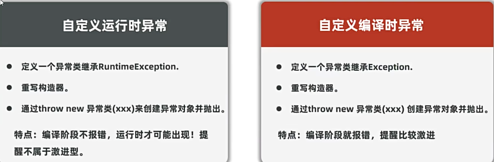

## 一、异常
* 异常是指程序出现的问题
  
**Java的异常体系**
* Error：
  * 代表系统级别的错误（严重问题），一旦系统出现问题，就会把这些问题封装成Error对象抛出。
  * Error不是程序员用的，因此开发人员不用管。
* Exception：异常，程序可能出现的问题，我们程序员通常会用Exception以及它的孩子来封装程序的问题。
  * 运行时异常：RuntimeException及其子类，编译阶段不会出现错误提醒，运行时出现的异常。
  * 编译时异常：编译阶段就会出现错误提示的。（如：日期错误解析异常）
* 异常的处理：
  * 1.抛出异常：在方法上使用throws关键字，可以将方法内部的异常抛出，让调用者处理。
  * 2.捕获异常：在方法内部使用try...catch...finally语句块，将异常捕获，处理异常。
例子：
```java
public class ExceptionDemo1 {
    public static void main(String[] args) {
        //认识异常体系，基本作用
        method();
        //处理异常方法二：捕获异常：try...catch
        try {
            show();
        } catch (ParseException e) {
            e.printStackTrace();//输出异常信息
        }
    }
    //定义方法认识编译异常
    //处理异常的方法一：使用throws关键字抛出异常
    public static void show() throws ParseException {
        //编译异常，编译时报错，编译不通过
        String str = "2012-12-12";
        //解析时间
        SimpleDateFormat sdf = new SimpleDateFormat("yyyy-MM-dd");
        Date date = sdf.parse(str);//编译异常，提醒程序员这里的程序容易出bug，注意。
        System.out.println(date);
        System.out.println("后续程序");
    }
    //定义方法认识运行时异常：
    public static void method(){
        //运行时异常的特点：编译不报错，运行时出现异常，继承自 RuntimeException
        int[] arr = {1,2,3};
        //System.out.println(arr[3]);//ArrayIndexOutOfBoundsException：数组越界异常
        //System.out.println(10/0);//ArithmeticException：数字操作异常
        //空指针异常
//        String str = null;
//        System.out.println(str.length());
        System.out.println("后续代码");//出现该异常后，后续代码不会执行
    }
}
```
## 二、异常的作用：
* 作用1：异常是用来定位程序的关键信息，便于程序员定位问题。
* 作用2：可以作为方法内部的一种特殊返回值。以便通知上层调用者，方法的执行问题。
例子：
```java
public class ExceptionDemo2 {
    public static void main(String[] args) {
        //认识异常的作用
        System.out.println("程序开始执行");
        System.out.println(div(10,0));
        System.out.println("程序结束执行");
    }
    public static int div(int a, int b){
        if(b==0){
            System.out.println("除数不能为0");
            //return -1;//这里返回-1，表示异常，但不太好
            //此时可以返回一个异常给上层调用者，返回的异常告知调用者。程序执行成功或失败
            throw new RuntimeException("除数不能为0");
        }
        int result = a/b;
        return result;
    }
}
```
## 三、自定义异常：
* 自定义异常：Java不可能总结到全部的异常来代表，当企业自己的某种问题，想通过异常表示，以便用异常管理问题，那就需要自己定义异常类。

* 编译时异常：
例子：
```java
/**
 * 自定义异常类：自定义编译时异常
 * 1.继承Exception
 * 2.重写构造器
 * 3.哪里需要异常就在哪throw
 */
public class AgeException extends Exception {
    public AgeException() {
    }
    public AgeException(String message) {
        super(message);
    }
}
```
```java
public class ExceptionDemo3 {
    public static void main(String[] args) {
        //认识自定义异常:编译时异常，
        System.out.println("程序开始执行");
        try{
            show( 0);
        }catch(AgeException e){
            System.out.println(e.getMessage());
        }
        System.out.println("程序结束执行");

    }
    //当年龄小于1岁或大于200岁时抛出异常
    public static void show(int age) throws AgeException {
        if(age<1 || age>200){
            //年龄不合法异常
            throw new AgeException("年龄不合法,不能小于1岁或大于200岁");
        }else{
            System.out.println("年龄合法");
            System.out.println("年龄是" + age);
        }
    }
}
```
* 运行时异常：
例子：
```java
/**
 * 自定义异常类：自定义运行时异常
 * 1.继承RuntimeException
 * 2.重写构造器
 * 3.哪里需要异常就在哪throw
 */
public class AgeRuntimeException extends RuntimeException {
    public AgeRuntimeException() {
    }

    public AgeRuntimeException(String message) {
        super(message);
    }
}
```
```java
public class ExceptionDemo4 {
    public static void main(String[] args) {
        //认识自定义异常:运行时异常
        System.out.println("程序开始执行");
        show( 0);

        System.out.println("程序结束执行");
    }
    //当年龄小于1岁或大于200岁时抛出异常
    public static void show(int age){
        if(age<1 || age>200){
            //年龄不合法异常
            throw new AgeRuntimeException("年龄不合法,不能小于1岁或大于200岁");
        }else{
            System.out.println("年龄合法");
            System.out.println("年龄是" + age);
        }
    }
}
```
* **在现在的开发过程中，更多会使用运行时异常。**
## 四、异常的处理方案：
* 1.将底层的异常层层上抛，最外层捕获异常，记录下异常信息，并响应适合用户观看的信息进行提示。
例子：
```java
public class ExceptionDemo5 {
    public static void main(String[] args) {
        //掌握异常的处理：层层抛出异常
        System.out.println("操作开始");
        try {
            show();
            System.out.println("操作成功");
        } catch (Exception e) {
            e.printStackTrace();//输出异常信息
            System.out.println("操作失败");
        }
        System.out.println("操作结束");
    }
    public static void show() throws Exception {
        //编译异常，编译时报错，编译不通过
        String str = "2012-12-12";
        //解析时间
        SimpleDateFormat sdf = new SimpleDateFormat("yyyy-MM-dd");
        Date date = sdf.parse(str);//编译异常，提醒程序员这里的程序容易出bug，注意。
        System.out.println(date);
        System.out.println("后续程序");
    }
}
```
* 2.捕获异常后尝试修复：
例子：
```java
public class ExceptionDemo6 {
    public static void main(String[] args) {
        //认识异常的处理：捕获异常，尝试修复
        System.out.println("程序开始");
        double price = 0;
        while (true) {
            try {
                price = price();
                System.out.println("商品的价格是：" + price);
                break;
            } catch (Exception e) {
                System.out.println("价格输入错误");;
            }
        }
        System.out.println("程序结束");
    }
    public static double price(){
        Scanner sc = new Scanner(System.in);
        System.out.println("请输入商品价格：");
        double price = sc.nextDouble();
        return price;
    }
}
```