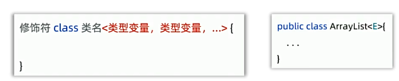
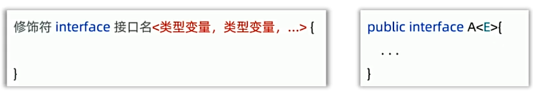
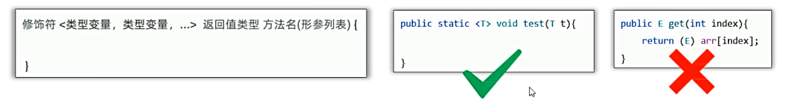
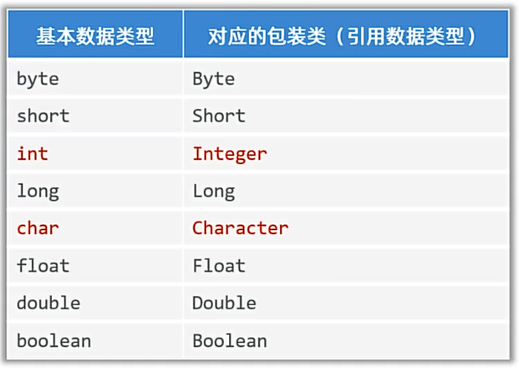
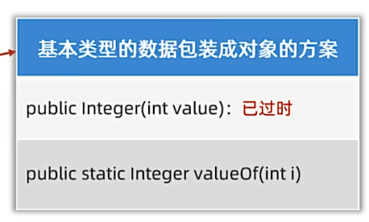
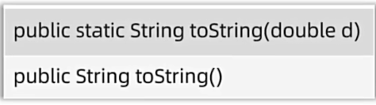
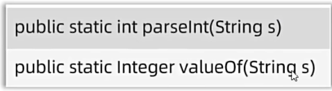

## 一、泛型

* 定义类、接口、方法时，同时声明了一个或多个类型变量（如："`<E>`"）
  称之为泛型类，泛型接口，泛型方法，它们统称为泛型。
* **作用：** 泛型提供了在编译阶段约束所能操作的数据类型，并自动进行检查的能力！这样可以避免强制类型转换，及其可能出现的异常。
* **本质：** 将具体的类型作为参数传给类型变量。
例子：
```java
public class GenericDemo1 {
    public static void main(String[] args) {
        // 认识泛型及其作用
        //若希望在强转时不出错，则需要在创建集合时使用泛型约束数据类型
        ArrayList<String> list = new ArrayList<String>();
        list.add("hello");
        list.add("world");
//        list.add(100);
//        list.add(true);

        for (int i = 0; i < list.size(); i++){
            Object rs = list.get(i);
            String str = (String) rs;// 若在数据类型不统一时强转，则会出现类型转换异常
            System.out.println(str);
        }
    }
}
```
## 二、泛型类

* 注意：类型变量建议用大写字母，如：E、T、K、V等。
自定义泛型类例子：
```java
public class MyArrayList <E>{
    //模拟自定义集合
    private ArrayList<E> list = new ArrayList<>();
    public void add(E e){
        list.add(e);
    }
    public boolean remove(int index){
        return list.remove(index) != null;
    }
    public int size(){
        return list.size();
    }
    @Override
    public String toString(){
        return list.toString();
    }
}
```
```java
public class GenericDemo2 {
    public static void main(String[] args) {
        //认识泛型类，自定义泛型类
        //模拟ArrayList集合，自定义一个MyArrayList集合
        //MyArrayList<String> list = new MyArrayList<String>();
        MyArrayList<String> list = new MyArrayList<>();//JDK7后，可以省略后面的泛型类型
        list.add("hello");
        list.add("world");
        System.out.println(list);

        list.remove(0);
        System.out.println(list);
    }
}
```
## 三、泛型接口

* 注意：类型变量建议用大写字母，如：E、T、K、V等。
例子：
```java
public interface Data<T> {
    void add(T t);
    void remove(T t);
    void update(T t);
    void query(int id);
}

public class StudentData implements Data<Student>{
    @Override
    public void add(Student student) {}
    @Override
    public void remove(Student student) {}
    @Override
    public void update(Student student) {}
    @Override
    public void query(int id) {}
}
```
## 四、泛型方法

例子：
```java
public class GenericDemo4 {
    public static void main(String[] args) {
        //定义泛型方法
        //打印任意数组的内容
        String[] arr = {"张三","李四","王五","赵六"};
        printArray(arr);

        Student[] stus = new Student[5];
        printArray(stus);
    }
    public static <T> void printArray(T[] arr) {
        for (int i = 0; i < arr.length; i++) {
            System.out.println(arr[i]);
        }
    }
}
```
## 五、通配符和上下限
* 通配符：`?`, 通配符可以在使用泛型时表示任意类型; E T K V是在定义泛型时使用。
* 上下限：
  * 泛型上限：`<? extends E>`，表示该泛型只能是E或者E的子类。
  * 泛型下限：`<? super E>`，表示该泛型只能是E或者E的父类。
例子：
```java
public class Car {
}
public class BMD extends Car{
}
public class Xiaomi extends Car{
}
public class GenericDemo5 {
    public static void main(String[] args) {
        //理解通配符和上下限
        ArrayList<Xiaomi> xiaomis = new ArrayList<>();
        xiaomis.add(new Xiaomi());
        xiaomis.add(new Xiaomi());
        go(xiaomis);
        ArrayList<BMD> bmds = new ArrayList<>();
        bmds.add(new BMD());
        bmds.add(new BMD());
        go(bmds);
    }
    //虽然Xiaomi和BMD都是Car的子类，但是ArrayList<Xiaomi> ArrayList<BMD> 和 ArrayList<Car> 是不能相互赋值的.
    //因此需要使用通配符代表一切类型
    //但此时会引发一个问题：会导致其他非汽车类的对象也被添加进去
    //因此，此时需要使用上限，表示只能是Car或者Car的子类
    public static void go(ArrayList<? extends Car> car){

    }
}
```
## 六、泛型支持的类型
* 泛型不支持基本数据类型，只能支持对象类型（引用数据类型）。
* 由此，便引出了包装类：
  * 包装类就是把基本数据类型包装成对象的类型：
   
  * 基本数据类型包装成对象类型：
  
* 自动装箱：基本数据类型自动转换为对应的包装类对象。
* 自动拆箱：包装类对象自动转换为对应的基本数据类型。
* 包装类的其他功能：
  * 可以把基本数据类型转换成字符串类型：
  
  * 可以把字符串类型的数值转换成数值本身对应的真实数据类型：
  

