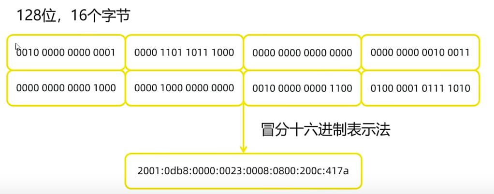

## 一、网络编程
* 可以让设备中的程序与网络上其他设备中的程序进行数据交互的技术（实现网络通信）。
* **基本的通信架构：**
  * 基本的通信架构有两种形式：CS架构（Client-Server架构）和BS架构（Browser-Server架构）。
  * CS架构：
   
  * BS架构：
   
* **java的net包下提供了网络编程的解决方案。**
## 二、网络通信三要素
* **IP地址**：设备在网络中的地址，是设备在网络中的唯一标识符，全程为“互联网协议地址”。
  * 目前，被广泛采用的IP地址为**IPv4：**Internet Protocol version 4，使用32位地址，通常以点分十进制表示。
   
  * **IPv6**：Internet Protocol version 6，使用128位地址，分为8段，每段每四位编码成一个十六进制位表示，每段之间用冒号分开，将这种方式称之为冒分十六进制。
  
  * **IP域名：** 用于在互联网上识别和定位网站的人类可读名称。（例如：www.baidu.com）
    * **DNS域名解析：** 互联网中用于将域名转换为对应IP地址的分布式命名系统。它充当了互联网的“电话簿”，将易记的域名映射到数字化的IP地址，使得用户可以通过域名来访问网站和其他网络资源。
  * **公网ip**：全称是Global Internet Protocol，是互联网协议，可以连接到互联网的IP地址。
  * **局域网ip**：全称是Local Area Network Protocol，是局域网协议，只能在组织机构内部使用的IP地址。例如：192.168.开头的就是常见的局域网地址，范围为192.168.0.0~192.168.255.255。专门为组织机构内部使用。
  * **本机IP地址**：127.0.0.1和localhost: 就是本机的IP地址，只会寻找当前程序所在的主机。
  * **IP常用命令：** 
    * ipconfig：查看本机IP地址。
    * ping IP地址：测试网络连通性。
* **InetAddress：** 代表IP地址。
 
* **端口号**：应用程序在设备中的唯一标识。
* **协议**：连接和数据在网络中传输的规则。
