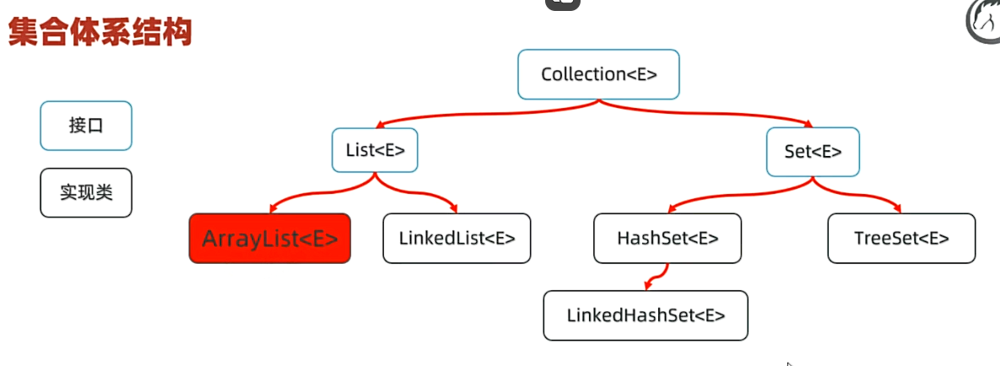
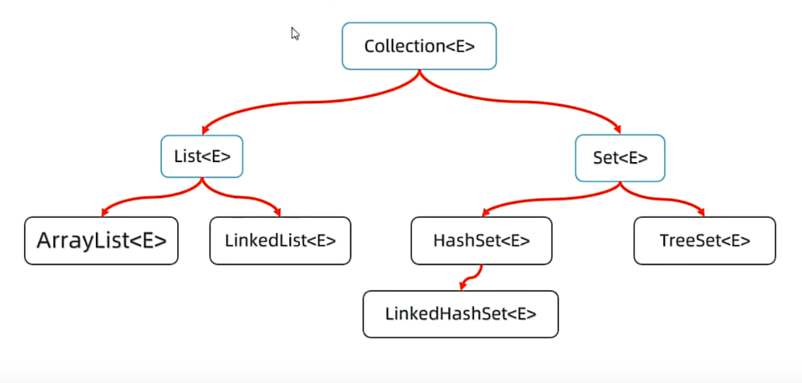
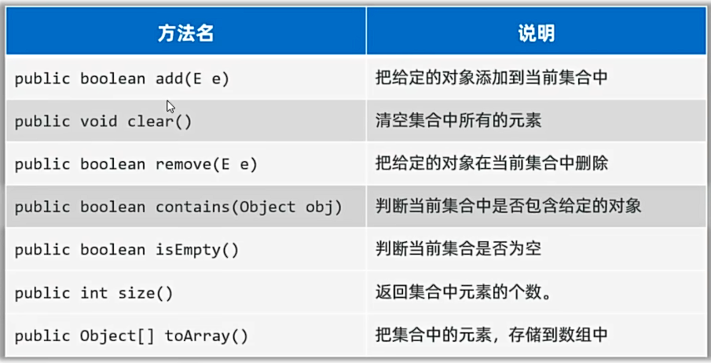
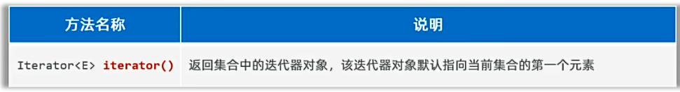
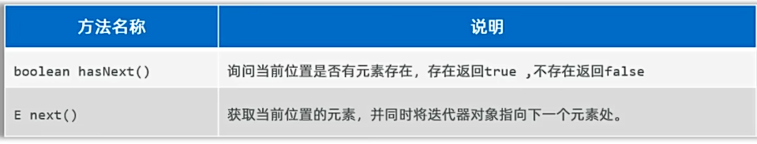
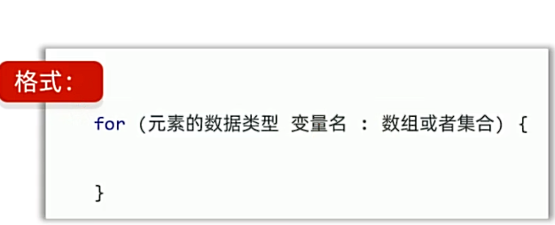
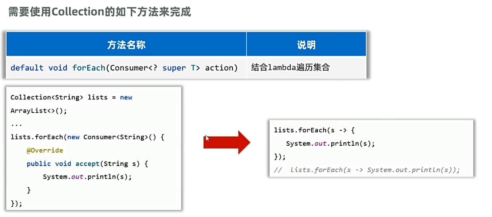
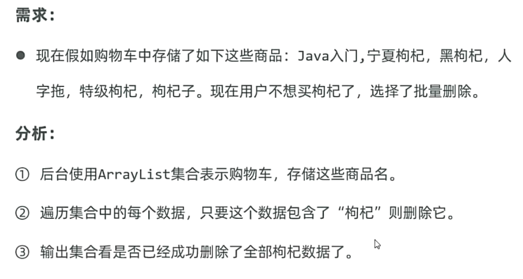

## 一、集合
* 集合是一种容器，装数据，类似于数组，但是数组的长度是固定的，集合的长度是可变的。开发中集合更常用。
* 集合的体系结构：
  * Collection: 单列集合，每个元素（数据）只包含一个值
  * Map：双列集合，每个元素包含两个值（键值对）。
## 二、Collection集合

### 1.Collection集合特点
* List系列集合：添加的元素有序、可重复、有索引。
  * ArrayList/LinkedList：有序、可重复、有索引。
* Set系列集合：添加的元素无序、不可重复、无索引。
  * HashSet:  无序、不可重复、无索引。
  * LinkedHashSet：有序、不可重复、无索引。
举例：
```java
public static void main(String[] args) {
        //认识集合
        // 1.List家族集合：有序，可以重复，有索引
        List<String> list = new ArrayList<>();
        list.add("hello");
        list.add("world");
        list.add("java");
        System.out.println(list);//[hello, world, java]顺序与插入顺序一致
        System.out.println(list.get(0));

        //Set集合：无序，不可重复，没有索引；
        Set<String> set = new HashSet<>();
        set.add("hello");
        set.add("world");
        set.add("java");
        System.out.println(set);//[world, java, hello]无序，无重复
    }
```
### 2. Collection集合的功能：
**先学Collection的方法**
* Collection是单列集合的祖宗，它规定的方法（功能）是全部单列集合都会继承的。
  
* 常用方法：
  
例子：
```java
  public static void main(String[] args) {
        //认识Collection的方法
        List<String> list = new ArrayList<String>();
        list.add("hello");
        list.add("world");
        list.add("java");
        list.add("python");
        list.add("c++");
        System.out.println(list);
        //获取集合的元素个数
        System.out.println(list.size());

        //删除元素
        list.remove(0);
        System.out.println(list);

        //判断集合是否为空
        System.out.println(list.isEmpty());

//        //清空集合
//        list.clear();
//        System.out.println(list);

        //集合转换成数组
        Object[] arr = list.toArray();
        System.out.println(Arrays.toString(arr));

        //集合转换成字符串数组
        String[] arr2 = list.toArray(new String[0]);
        System.out.println(Arrays.toString(arr2));

    }
```
### 3.Collection集合的遍历方式：
* 1.迭代器：迭代器是用来遍历集合的专用方式（数组没有迭代器），Java中，迭代器的代表是Iterator。
* Collection集合获取迭代器的方法：
  
* Iterator迭代器的常用方法：
* 
例子：
```java
 public static void main(String[] args) {
        //认识Collection迭代器遍历
        List<String> list = new ArrayList<String>();
        list.add("hello");
        list.add("world");
        list.add("java");
        list.add("python");
        list.add("c++");
        list.add("GO");
        System.out.println(list);

        //1.得到集合迭代器对象
        Iterator<String> it = list.iterator();
//        System.out.println(it.next());
//        System.out.println(it.next());
//        System.out.println(it.next());
//        System.out.println(it.next());
//        System.out.println(it.next());
//        System.out.println(it.next());
        //System.out.println(it.next());//报异常,NoSuchElementException
        //2.使用while循环遍历集合
        while(it.hasNext()){
            System.out.println(it.next());//若不定义变量直接输出it.next()，则只能写一次该方法，否则可能会报异常
        }
    }
```
### 4.增强for循环：

* 增强for可以遍历集合和数组。
* 增强for遍历集合，本质是迭代器遍历集合的简化写法。
例子：
```java
  public static void main(String[] args) {
        //认识Collection迭代器遍历，for增强
        List<String> list = new ArrayList<String>();
        list.add("hello");
        list.add("world");
        list.add("java");
        list.add("python");
        list.add("c++");
        list.add("GO");
        System.out.println(list);

        for(String s : list){
            System.out.println(s);
        }

        //同时增强for可遍历数组
        int[] arr = {1,2,3,4,5,6,7,8,9,10};
        for(int i : arr){
            System.out.println(i);
        }
    }
```
### 5.Lambda表达式遍历：
* JDK8开始由于Lambda表达式，提供了一种更简单、更直接的方式遍历集合。

例子：
```java
public class CollectionDemo5 {
    public static void main(String[] args) {
        //认识Collection迭代器遍历，for增强
        List<String> list = new ArrayList<String>();
        list.add("hello");
        list.add("world");
        list.add("java");
        list.add("python");
        list.add("c++");
        list.add("GO");
        System.out.println(list);

//        list.forEach(new Consumer<String>(){
//            @Override
//            public void accept(String s) {
//                System.out.println(s);
//            }
//        });
        //上述例子可简化为：
//        list.forEach( s  -> System.out.println(s));
        //使用方法引用接着简化：
        list.forEach(System.out::println);
    }
}
```
### 6.三种遍历方式的区别：
* 并发修改异常问题：
  * 遍历集合的同时又存在增删集合元素的行为时可能出现业务异常，被称之为并发修改异常问题。
使用需求来说明并发修改异常问题：

例子：
```java
public class CollectionDemo6 {
    public static void main(String[] args) {
        //认识并发修改异常问题
        ArrayList<String> list = new ArrayList<>();
        list.add("hello");
        list.add("world");
        list.add("java");
        list.add("python");
        list.add("C++");
        list.add("C");
        list.add("C#");
        list.add("GO");
        System.out.println(list);

        //删除带C的语言
//        for (int i = 0; i < list.size(); i++) {
//            String s = list.get(i);
//            if (s.contains("C")) {
//                list.remove(s);
//            }
//        }

//        [hello, world, java, python, C++, C, C#, GO]
//        [hello, world, java, python, C, GO]
        //此时，出现了并发修改异常，因为，在for循环中，我们删除了list中的元素，导致list.size()的值发生了变化
        //因为当i=4时，list删除了C++，导致C到了C++的位置，此时i+1=5，无法遍历到C，因此C并未被删除
        //解决方案一：若要用for循环解决上述问题，在末尾让i--，即可(前提要支持索引)
//        for (int i = 0; i < list.size(); i++) {
//            String s = list.get(i);
//            if (s.contains("C")) {
//                list.remove(s);
//                i--;
//            }
//        }
//        System.out.println(list);
        //解决方案二：倒过来遍历，即从后往前遍历，这样删除的索引不会发生变化（前提要支持索引）
//        for (int i = list.size() - 1; i >= 0; i--) {
//            String s = list.get(i);
//            if (s.contains("C")) {
//                list.remove(s);
//            }
//        }
//        System.out.println(list);
        //迭代器修改
        Iterator<String> it = list.iterator();
        while (it.hasNext()) {
            String s = it.next();
            if (s.contains("C")) {
//                list.remove(s);//会出现并发修改异常，需要使用迭代器自己的方法
                it.remove();
            }
        }
        System.out.println(list);
        //使用增强for和Lambda表达式都无法解决问题
        //由此可得出结论：增强for和Lambda表达式只适合用于遍历，不适合用于修改
    }
}
```
* **由上述例子最终可以得出并发修改异常的解决方案：**
* 1.若集合支持索引，可使用for循环遍历，每删除数据后i--，或者从后往前倒着遍历。
* 2.若集合不支持索引，使用迭代器遍历，使用迭代器的remove方法删除数据。
* **3.增强for和Lambda表达式只适合用于遍历，不适合用于修改。无法解决并发修改异常**
